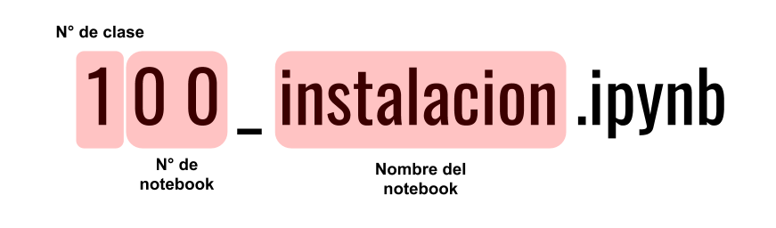
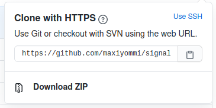

# Señales y Sistemas - Ingeniería de Sonido - Universidad Nacional de Tres de Febrero 


Repositorio con el contenido práctico de la asignatura Señales y Sistemas de la carrera [Ingeniería de Sonido](https://www.untref.edu.ar/carrera/ingenieria-de-sonido), en la [Universidad Nacional de Tres de Febrero](https://www.untref.edu.ar), Buenos Aires - Argentina.

El contenido esta orientado para alumnos con algún conocimiento previo de programación y de ninguna manera pretende ser un curso de programación en Python, sino más bien un material de apoyo intenso y desafiante, que invita a pensar y a desarrollar soluciones para validar los resultados analíticos de las [guiá de la asignatura](guia_ejercicios.pdf).

## Como comenzar

Todas las clases de este repositorio están desarrolladas en *notebooks* de [Jupyter](https://jupyter.org/). La numeración de los notebooks esta definida de la siguiente manera



> Es importante aclarar, cuando mencionemos **notebook**, se hará referencia al archivo .ipynb, en lugar al programa de **Jupyter Notebook**. El termino **notebook** se hereda de [IPython](https://es.wikipedia.org/wiki/IPython).

Para **usar** el material de este repositorio se puede optar varios caminos:

* De manera online:
    * [GitHub](https://github.com/maxiyommi/signal-systems) o desde [nbviewer](https://nbviewer.jupyter.org/github/maxiyommi/signal-systems/tree/master/). En ambos casos son una web estática, esto quiere decir que **no podemos interactuar con el material**.
    * [Google Colab](colab.research.google.com) o [Blinder](https://mybinder.org/), **podemos interactuar con el material**.

* De manera offline:
    * Instalar un interprete de notebooks como[Jupyter](https://jupyter.org/), con ayuda del siguiente [instructivo](https://gist.github.com/maxiyommi/a21fa6af877d1e00f1498e60654e6c4a).
    
    * Descargar el material del repositorio:
        * Con `git` instalado en nuestro sistema operativo, la forma más fácil de acceder a estos archivos es clonar el repositorio en el directorio que elija.

            ``` bash
            git clone https://github.com/maxiyommi/signal-systems.git
            ```

        * Sin `git` instalado, puede descargar todo el repositorio como un archivo .zip desde la página de inicio del repositorio utilizando el botón verde "Clonar o descargar" en la esquina superior derecha.

            

        > Para conocer más sobre git, se recomienda leer el siguiente [documento](https://gist.github.com/maxiyommi/b5d2ef4c66f17870a92bc27f4afe71c2) de ayuda.
    
## Consultas
Las consultas sobre el material y/o consigna del TP están centralizadas en el espacio de trabajo de [Slack](https://slack.com/intl/es-ar/). Por favor consultar el [siguiente documento](https://github.com/maxiyommi/signal-systems/blob/master/reglas_slack.md) para realizar las consultas apropiadamente.
* [Unirte al espacio de trabajo](https://join.slack.com/t/senalesysistemas/shared_invite/zt-o44s05m8-Yhw_W10tEch6fBy~e8mo2w)

## Contenido teórico
Ingresar con el usuario personal al [**Aula virtual**](https://presenciales.untref.edu.ar/acceso.cgi).

## Bibliografia recomendada para seguir las clases

La mayor parte del contenido teórico de este curso fue extraida de: 

* Varoquaux, G., Gouillart, E., Vahtras, O., Haenel, V., Rougier, N. P., Gommers, R., ... & Pinte, D. *Scipy lecture note*, 2015
* Van Rossum, Guido; Drake, Fred L. *The python language reference manual*. Network Theory Ltd., 2011.

## Sitios de interes
* https://realpython.com
* https://medium.com/
* https://stackoverflow.com/

## Docentes
* **Lic. [Miriam Sassano](https://www.linkedin.com/in/miryam-patricia-sassano-7878189)** - miryam.sassano@gmail.com
* **Ing. Antonio Greco** - antogreco2015@gmail.com
* **Ing. [Maximiliano Yommi](https://www.linkedin.com/in/myommi)** - myommi@untref.edu.ar
* **Tec. [Agustín Morelli](https://www.linkedin.com/in/agustin-morelli-443849a3)** - agustinmorelli88@gmail.com

## Licencia
<a rel="license" href="http://creativecommons.org/licenses/by-sa/4.0/"></a><br />Este documento se destribuye con una <a rel="license" href="http://creativecommons.org/licenses/by-sa/4.0/">licencia Atribución CompartirIgual 4.0 Internacional de Creative Commons</a>.

Material adaptado del curso [Introducción a Python](https://github.com/infiniemlabs-acustica/python_introduccion)

© 2020. Infiniem Labs Acústica. infiniemlab.dsp@gmail.com (CC BY-SA 4.0))
