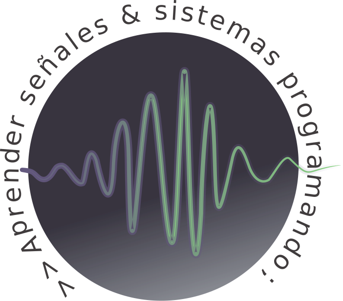

# Señales y Sistemas - Ingeniería de Sonido - UNTREF



> **Sitio web del curso**: [maxiyommi.github.io/signal-systems](https://maxiyommi.github.io/signal-systems/)

Repositorio con el contenido práctico de la asignatura Señales y Sistemas de la carrera [Ingeniería de Sonido](https://www.untref.edu.ar/carrera/ingenieria-de-sonido), en la [Universidad Nacional de Tres de Febrero](https://www.untref.edu.ar), Buenos Aires - Argentina.

## Cursada 2026

El curso se estructura en **3 pilares**:

| Pilar | Descripción |
|-------|-------------|
| **Lógica y programación** | Python, estructuras de datos, funciones, NumPy/SciPy, procesamiento de señales |
| **Vibecoding, Agents, Skills** | IA como herramienta de desarrollo: Claude.ai, ChatGPT, Ollama, agentes |
| **De idea a MVP** | Git, testing, CI/CD, documentación, packaging — el TP como producto real |

**2.º cuatrimestre 2026**: las semanas 1 a 6 (teoría + Prácticas 1 a 3) están a cargo de la Prof. Trina Adrián de Pérez. Desde la semana 7, la práctica se dedica al TP RIR-API: 7 sesiones los miércoles, del 30 de septiembre al 18 de noviembre de 2026 (4 presenciales + 3 virtuales). Los notebooks del curso completo quedan como material de apoyo para trabajar durante la semana.

> Ver el [cronograma de la cursada](cronograma.md) y el [curso completo (15 clases)](clases/README.md).

---

## Cómo comenzar

Todo el material de la cursada está en el [**sitio del curso**](https://maxiyommi.github.io/signal-systems/): los primeros pasos (entorno, Git, Slack y la ruta del TP), las sesiones con sus fechas y los enlaces de cada milestone. Empezar siempre por ahí.

Para trabajar con los notebooks de las clases en tu computadora:

### 1. Configurar el entorno

Seguir la [guía de configuración del entorno](guias/setup_entorno.md):

```bash
# Instalar Python 3.12+, luego:
curl -LsSf https://astral.sh/uv/install.sh | sh   # Instalar uv
uv tool install marimo                              # Instalar Marimo
```

### 2. Clonar el repositorio

```bash
git clone https://github.com/maxiyommi/signal-systems.git
cd signal-systems
```

### 3. Usar el material

Las clases usan **Marimo** — notebooks reactivos en archivos `.py`:

```bash
# Abrir un notebook en modo edición
marimo edit clases/clase_01/contenido.py

# Ejecutar en modo solo lectura
marimo run clases/clase_01/contenido.py
```

> **Marimo** reemplaza a Jupyter. Los archivos son Python puro, reactivos y se versionan limpiamente con Git. Ver la [guía de Marimo](guias/marimo_intro.md).

---

## Estructura del repositorio

```
signal-systems/
├── clases/                  # Material clase a clase (15 clases)
│   ├── clase_01/            # Contenido, ejercicios, soluciones (Marimo)
│   ├── clase_02/ ... clase_15/
│   └── README.md            # Índice de clases
├── trabajo_practico/        # Trabajo práctico: RIR-API (ISO 3382)
│   ├── README.md            # Consigna completa
│   ├── ruta.md              # Ruta del TP (orden de lectura)
│   ├── marco_conceptual.md  # El fenómeno y su modelo (con interactivos)
│   ├── especificacion/      # Especificaciones por milestone (M0-M3)
│   ├── interactivos/        # Escenas interactivas (se abren en pestaña aparte desde el sitio)
│   └── template_repo/       # Punto de partida del repositorio de cada grupo
├── material_extra/          # Material complementario
│   ├── ggwave/              # Transmisión de datos por sonido
│   ├── GameOfLife/          # Autómata celular
│   ├── recursos_ia/         # Guías de IA y prompting
│   └── ...
├── guias/                   # Guías auxiliares
│   ├── setup_entorno.md     # Instalación y configuración
│   ├── git_basico.md        # Cheatsheet de Git
│   ├── marimo_intro.md      # Cómo usar Marimo
│   └── quarto_informe.md    # Informes con Quarto (opcional)
├── docs/, hooks/, mkdocs.yml # Sitio web (MkDocs Material): cada push a master lo publica
├── cronograma.md            # Cronograma de la cursada + curso completo
└── guia_ejercicios.pdf      # Guía de ejercicios teóricos
```

## Clases

La distribución del material clase a clase se encuentra en el [índice de clases](clases/README.md).

## Trabajo práctico

**RIR-API** — API REST (FastAPI) para cálculo de parámetros acústicos ISO 3382. Empezar por la [ruta del TP](trabajo_practico/ruta.md) (orden de lectura) y la [consigna](trabajo_practico/README.md).

| Milestone | Entrega | Contenido |
|-----------|---------|-----------|
| M0 · El plano (arquitectura) | Mié 7/10 (Slack/GitHub) | Plan, diagrama, repo, endpoint /health |
| M1 · Generación de señales | Mié 28/10 | Ruido rosa, sine sweep, grabación + primeros endpoints |
| M2 · Procesamiento de la RI | Mié 4/11 | Deconvolución, bandas de octava, escala en dB + endpoints con archivos |
| M3 · Producto final | Mié 18/11 | Parámetros ISO 3382, API completa, validación, presentación oral |

M0, M1 y M2 son de seguimiento (sin nota). La nota del TP es 60 % M3 + 40 % presentación oral — ver la [rúbrica](trabajo_practico/rubrica.md).

## Guías auxiliares

- [Configuración del entorno](guias/setup_entorno.md) — Python, uv, VS Code, Git, Marimo
- [Git básico](guias/git_basico.md) — Cheatsheet para la cursada
- [Marimo](guias/marimo_intro.md) — Notebooks interactivos
- [Quarto](guias/quarto_informe.md) — Informes técnicos (opcional; el TP no pide informe escrito)
- [Recursos de IA](material_extra/recursos_ia/README.md) — Herramientas y prompting

## Contenido teórico

Ingresar con el usuario personal al [**Aula virtual**](https://presenciales.untref.edu.ar/acceso.cgi).

## Consultas

Las consultas están centralizadas en [Slack](https://slack.com/intl/es-ar/). Ver las [reglas del espacio](reglas_slack.md).

- [Unirte al espacio de trabajo](https://join.slack.com/t/senalesysistemas/shared_invite/zt-4b8dg2vx3-E1FFLCoIbok2AB5Es5MeVQ)
- Las sesiones virtuales son por [Google Meet](https://meet.google.com/rzi-ossp-mae).

## Herramientas del curso

| Herramienta | Uso |
|-------------|-----|
| [Python 3.12+](https://python.org) | Lenguaje principal |
| [uv](https://astral.sh/uv) | Gestor de paquetes |
| [VS Code](https://code.visualstudio.com) | IDE |
| [Git](https://git-scm.com) + [GitHub](https://github.com) | Control de versiones |
| [Marimo](https://marimo.io) | Notebooks interactivos |
| [FastAPI](https://fastapi.tiangolo.com) | API REST del TP |
| [pytest](https://pytest.org) | Testing |
| [ruff](https://docs.astral.sh/ruff/) | Linting y formateo |
| [Claude.ai](https://claude.ai) / [ChatGPT](https://chat.openai.com) | IA (gratuito) |

## Bibliografía recomendada

- Varoquaux, G., et al. *Scipy lecture notes*, 2015
- Van Rossum, G.; Drake, F. *The Python language reference manual*. Network Theory Ltd., 2011
- Oppenheim, A.; Willsky, A. *Señales y Sistemas*. Prentice Hall, 1997
- [Real Python](https://realpython.com) | [Stack Overflow](https://stackoverflow.com)

## Curso recomendado

- [Curso de LÓGICA DE PROGRAMACIÓN Desde Cero - Brais Moure](https://www.youtube.com/watch?v=TdITcVD64zI)

## Docentes

- **Teoría:** Prof. Trina Adrián de Pérez
- **Práctica:**
  - **Ing. [Maximiliano Yommi](https://maxiyommi.github.io/portfolio_insight/)** — myommi@untref.edu.ar
  - **[Jerónimo Scafati](https://www.linkedin.com/in/jeronimo-scafati/)**

## Licencia

[](http://creativecommons.org/licenses/by-sa/4.0/)

Este documento se distribuye con una [licencia Atribución CompartirIgual 4.0 Internacional de Creative Commons](http://creativecommons.org/licenses/by-sa/4.0/).
© 2026 (CC BY-SA 4.0).
