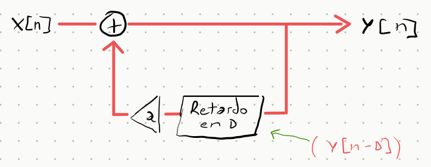
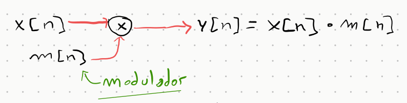
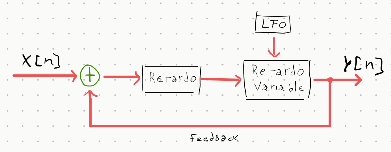
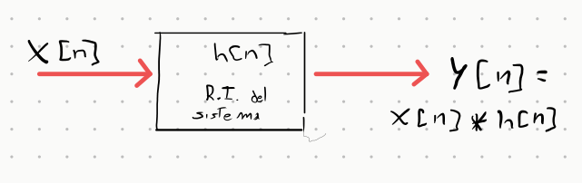

# Efectos de Audio en Python

> **Clase 06 — Material complementario**<br>
> Audio en Python: efectos de señal desde el marco de Señales y Sistemas<br>
*Por Jerónimo Scafati*


En esta sección implementamos efectos de audio clásicos y los analizamos como **sistemas**. Cada efecto tiene propiedades bien definidas (causalidad, linealidad, invarianza temporal, estabilidad) que determinan su comportamiento y sus posibilidades musicales.

---

## Clasificación de los sistemas

Antes de ver los efectos, es útil tener un mapa de las propiedades que vamos a usar:

| Propiedad | Significado | Ejemplo |
|-----------|-------------|---------|
| **LTI** | Lineal y tiempo-invariante | Delay con parámetros fijos |
| **LTV** | Lineal y **tiempo-variante** | Tremolo, Flanger |
| **Causal** | Usa solo muestras presentes y pasadas | Todos los efectos de audio en tiempo real |
| **IIR** | Respuesta al impulso infinita (hay feedback) | Delay con retroalimentación |
| **FIR** | Respuesta al impulso finita (sin feedback) | Tremolo, Flanger |
| **BIBO estable** | Entrada acotada → salida acotada | Delay con \|g\| < 1 |

---

## 1. Delay (Eco)

### Fundamento teórico

El delay es el efecto más elemental: suma a la señal original una copia de sí misma, retardada $D$ muestras y atenuada por la ganancia de retroalimentación $g$.

**Ecuación en diferencias:**

$$y[n] = x[n] + g \cdot y[n - D]$$

La retroalimentación hace que cada eco genere nuevos ecos, con amplitud decayendo geométricamente. La respuesta al impulso resulta en la suma infinita:

$$h[n] = \sum_{k=0}^{\infty} g^k \cdot \delta[n - kD]$$

Esta sumatoria infinita clasifica al sistema como **IIR** (*Infinite Impulse Response*).

### Diagrama del sistema



### Propiedades

- **Causal** ✅ — $y[n]$ depende de $x[n]$ y de $y[n-D]$ (pasado), nunca del futuro.
- **LTI** ✅ — con $g$ y $D$ fijos, el sistema es lineal y tiempo-invariante.
- **IIR** — la respuesta al impulso es infinita (ecos que se repiten indefinidamente).
- **Estabilidad** — el sistema es BIBO estable si y solo si $|g| < 1$. Los polos se ubican en $z_k = g^{1/D}$, dentro del círculo unitario. Con $|g| \geq 1$ el sistema diverge (ecos que crecen sin límite).

### Visualización interactiva

Generá un impulso y observá cómo se propaga la energía por el sistema. Modificá $D$ y $g$ para ver cómo cambia la densidad y el decaimiento de los ecos.

<div style="border-radius:8px; overflow:hidden; border:1px solid #30363d;">
<iframe src="assets/delay_viz.html" style="width:100%; height:430px; border:none; display:block;"></iframe>
</div>

### Implementación

```python title="efectos.py"
def delay(
    x: NDArray[np.float64],
    fs: int,
    delay_time: float = 0.5,   # segundos entre ecos
    feedback:   float = 0.3,   # ganancia de retroalimentación (< 1)
    dry_wet:    float = 0.5,   # mezcla seco/húmedo
) -> NDArray[np.float64]:

    delay_samples = int(delay_time * fs)
    y = np.zeros(len(x))

    for i in range(len(x)):
        echo = y[i - delay_samples] if i >= delay_samples else 0.0
        y[i] = x[i] + feedback * echo          # ecuación en diferencias

    return (1.0 - dry_wet) * x + dry_wet * y   # mezcla dry/wet
```

```python title="Uso"
import soundfile as sf
from efectos import delay

audio, fs = sf.read("guitar.wav")
y = delay(audio, fs, delay_time=0.4, feedback=0.5, dry_wet=0.6)
sf.write("guitar_delay.wav", y, fs)
```

!!! note "Parámetro `feedback`"
    La condición $|g| < 1$ no es opcional: es la condición matemática de **estabilidad BIBO** del sistema. Valores iguales o mayores a 1 producen ecos que crecen indefinidamente, lo que en la práctica satura (o destruye) el sistema de audio.

---

## 2. Tremolo

### Fundamento teórico

El tremolo varía la **amplitud** de la señal en el tiempo. Es la versión audio de la **Modulación de Amplitud (AM)**: la señal portadora $x[n]$ se multiplica por una señal modulante $m[n]$ generada por un Oscilador de Baja Frecuencia (**LFO**).

**Ecuación:**

$$y[n] = x[n] \cdot m[n]$$

$$m[n] = (1 - d) + d \cdot \frac{1 + \sin(2\pi f_{mod} \cdot n/f_s)}{2}$$

El parámetro $d$ (*depth*) controla qué tan profunda es la modulación: con $d=0$ la señal queda inalterada, con $d=1$ la señal alcanza silencio en los valles del LFO.

### Diagrama del sistema



### Propiedades

- **Lineal** ✅ — $y[n]$ es lineal en $x[n]$ para cualquier $m[n]$ dado.
- **Tiempo-variante (LTV)** ❌ — $m[n]$ depende de $n$, por lo tanto el sistema **no es LTI**. Un sistema LTI multiplicado por una señal variable en el tiempo deja de ser LTI.
- **Sin memoria (FIR)** — $y[n]$ depende solo de $x[n]$ en el instante actual. No hay retroalimentación.
- **Siempre estable** ✅ — $m[n] \in [1-d, 1] \subseteq [0, 1]$, por lo que $|y[n]| \leq |x[n]|$ en todo momento.
- **Causal** ✅ — no requiere valores futuros de la señal.

!!! info "¿Por qué no es LTI?"
    Un sistema es **tiempo-invariante** si retardar la entrada produce exactamente el mismo retardo en la salida. Pero en el tremolo, si retardamos $x[n]$ por $k$ muestras, la salida es $x[n-k] \cdot m[n]$, **no** $x[n-k] \cdot m[n-k]$. La envolvente $m[n]$ no se mueve con la señal → el sistema es variante en el tiempo.

### Visualización interactiva

Observá cómo el LFO modula la envolvente de la señal. Con $d=1$ la señal se "apaga" completamente en cada valle. Con $f_{mod}$ alta el tremolo se vuelve un efecto de trémolo rápido o incluso genera bandas laterales audibles (como en AM de radio).

<div style="border-radius:8px; overflow:hidden; border:1px solid #30363d;">
<iframe src="assets/tremolo_viz.html" style="width:100%; height:430px; border:none; display:block;"></iframe>
</div>

### Implementación

```python title="efectos.py"
def tremolo(
    x:     NDArray[np.float64],
    fs:    int,
    depth: float = 0.8,   # profundidad [0, 1]
    f_mod: float = 1.0,   # frecuencia del LFO en Hz
) -> NDArray[np.float64]:

    t   = np.arange(len(x)) / fs
    lfo = 0.5 * (1.0 + np.sin(2.0 * np.pi * f_mod * t))   # ∈ [0, 1]
    mod = (1.0 - depth) + depth * lfo                       # ∈ [1-d, 1]
    return x * mod
```

```python title="Uso"
from efectos import tremolo

y = tremolo(audio, fs, depth=0.8, f_mod=5.0)   # tremolo a 5 Hz
```

!!! tip "Rangos típicos"
    - `depth` entre 0.5 y 0.9 produce el efecto clásico de tremolo musical.
    - `f_mod` entre 1 y 8 Hz es el rango usual. Con valores >20 Hz la modulación genera **bandas laterales** (AM sidebands) y cambia el timbre.

---

## 3. Flanger / Chorus

### Fundamento teórico

El flanger y el chorus son el **mismo sistema** con diferentes rangos de parámetros. Ambos mezclan la señal original con una copia retardada, pero el retardo $D(n)$ **varía en el tiempo** controlado por un LFO:

$$y[n] = x[n] + x[n - D(n)]$$

$$D(n) = D_0 + A \cdot \sin(2\pi f_{LFO} \cdot n/f_s)$$

La variación del retardo produce un **efecto Doppler** en la copia: la señal se estira y comprime en frecuencia. Al sumar con la original, las frecuencias que están en fase se refuerzan y las que están en contrafase se cancelan, generando un **filtro peine** (*comb filter*) cuya frecuencia de corte varía con el LFO.

| Parámetro | **Flanger** | **Chorus** |
|-----------|-------------|------------|
| Retardo $D_0$ | 1–10 ms | 15–35 ms |
| Amplitud LFO $A$ | ≈ $D_0$ | 5–15 ms |
| $f_{LFO}$ | 0.1–1 Hz | 0.1–1 Hz |
| Efecto percibido | "jet" metálico | "coro" de voces |

La diferencia auditiva viene del retardo base: con retardos cortos (< 10 ms) el oído no percibe el eco como separado, sino como coloración tímbrica (flanger). Con retardos largos (> 15 ms) se perciben como "voces" distintas (chorus).

### Diagrama del sistema



### Propiedades

- **Tiempo-variante (LTV)** ❌ — el retardo varía con $n$, rompiendo la invarianza temporal.
- **Lineal** ✅ — la suma de dos señales lineales sigue siendo lineal.
- **Sin memoria (FIR)** — no hay retroalimentación; en cada instante solo se leen posiciones pasadas del buffer.
- **Causal** ✅ — $D(n) > 0$ siempre, por lo que solo se leen muestras pasadas.

### Visualización interactiva

Usá los presets para comparar flanger y chorus. Observá en el panel del buffer cómo el puntero de lectura (azul) oscila alrededor del puntero de escritura (rojo), generando la variación de retardo.

<div style="border-radius:8px; overflow:hidden; border:1px solid #30363d;">
<iframe src="assets/flanger_viz.html" style="width:100%; height:500px; border:none; display:block;"></iframe>
</div>

!!! note "Filtro peine"
    Cuando $D$ es fijo, $y[n] = x[n] + x[n-D]$ tiene respuesta en frecuencia $|H(e^{j\omega})| = |1 + e^{-j\omega D}|$, que es un **filtro peine** con ceros en $\omega = \pi/D + k\pi/D$. El LFO mueve estos ceros en frecuencia continuamente, creando el característico "barrido".

---

## 4. Reverb por Convolución

### Fundamento teórico

La reverberación simula la acústica de un espacio físico. Por el **Teorema de Representación de Sistemas LTI**, cualquier sala puede caracterizarse completamente por su **Respuesta al Impulso** $h[n]$ (*Impulse Response*, IR).

Conocida la IR, la salida ante cualquier entrada $x[n]$ es la **convolución discreta**:

$$y[n] = (x * h)[n] = \sum_{k=0}^{M-1} x[k] \cdot h[n - k]$$

Para IRs largas (salas grandes → IR de varios segundos), la convolución directa tiene complejidad $O(N^2)$. Se usa en cambio el **Teorema de convolución** para reducirla a $O(N \log N)$ vía FFT:

$$Y(\omega) = X(\omega) \cdot H(\omega) \quad \Longrightarrow \quad y[n] = \text{IFFT}\{X \cdot H\}$$

### Diagrama del sistema



### Propiedades

- **LTI** ✅ — la sala es un sistema lineal y tiempo-invariante (a temperatura y presión fijas).
- **Causal** ✅ — $h[n] = 0$ para $n < 0$; ningún eco llega antes del impulso.
- **IIR** — la IR de una sala tiene colas de reverberación que decaen gradualmente.
- **Longitud de salida** — la salida tiene longitud $N + M - 1$, donde $M$ es la longitud de la IR. La diferencia corresponde a la **cola de reverberación** natural.

### Implementación

```python title="conv.py"
def convolve_ir(
    x:         NDArray[np.float64],
    fs_x:      int,
    ir:        NDArray[np.float64],
    fs_ir:     int,
    normalize: bool = True,
) -> NDArray[np.float64]:
    # Re-muestrear IR si es necesario
    if fs_x != fs_ir:
        ...  # interpolación lineal

    # Convolución vía FFT: O(N log N)
    y = signal.fftconvolve(x, ir, mode="full")

    if normalize:
        y = y / np.max(np.abs(y))
    return y
```

```python title="Uso"
import soundfile as sf
from conv import convolve_ir

x,  fs_x  = sf.read("guitar.wav")
ir, fs_ir = sf.read("ir_catedral.wav")   # IR grabada en una catedral real

y = convolve_ir(x, fs_x, ir, fs_ir)
sf.write("guitar_catedral.wav", y, fs_x)
```

!!! tip "IRs gratuitas"
    Existen bases de datos de IRs de salas famosas grabadas con globos o pistolas de salva. Una de las más completas es [OpenAIR](https://www.openairlib.net/).

---

## Resumen comparativo

| Efecto | Sistema | LTI | Feedback | Complejidad |
|--------|---------|-----|----------|-------------|
| **Delay** | Recursivo, IIR | ✅ | ✅ | $O(N)$ |
| **Tremolo** | Multiplicador AM, FIR | ❌ (LTV) | ❌ | $O(N)$ |
| **Flanger/Chorus** | Retardo variable, FIR | ❌ (LTV) | ❌ | $O(N)$ |
| **Reverb conv.** | Convolución LTI | ✅ | ❌ | $O(N \log N)$ |

## Archivos del módulo

| Archivo | Contenido |
|---------|-----------|
| [`efectos.py`](https://github.com/maxiyommi/signal-systems/blob/master/material_extra/efectos_audio/efectos.py) | `tremolo()`, `delay()` |
| [`func.py`](https://github.com/maxiyommi/signal-systems/blob/master/material_extra/efectos_audio/func.py) | `normalizar()`, `to_mono()`, `diente_de_sierra()` |
| [`conv.py`](https://github.com/maxiyommi/signal-systems/blob/master/material_extra/efectos_audio/conv.py) | `convolve_ir()` — reverb convolutiva via FFT |
ctos_audio/conv.py) | `convolve_ir()` — reverb convolutiva via FFT |
os_audio/conv.py) | `convolve_ir()` — reverb convolutiva via FFT |
ctos_audio/conv.py) | `convolve_ir()` — reverb convolutiva via FFT |
