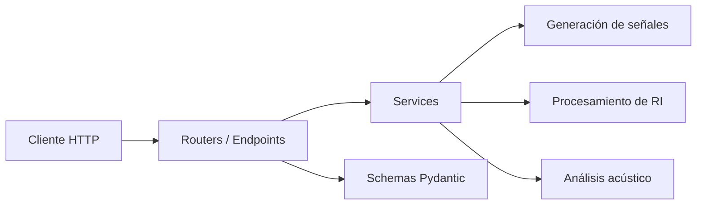

# M0 · El plano (arquitectura)

!!! info "Fechas y evaluación"
    - **Presentación de la consigna:** miércoles 30 de septiembre de 2026 (presencial)
    - **Entrega:** miércoles 7 de octubre de 2026, asincrónica por Slack/GitHub (ese día no hay clase)
    - **Evaluación:** seguimiento, sin nota (el grupo muestra su avance y recibe feedback por Slack)

## Objetivo

Planificar la arquitectura del software antes de escribir una sola línea de código. Este milestone busca que el grupo defina la estructura del proyecto, distribuya responsabilidades y establezca las bases para un desarrollo organizado y colaborativo.

## Por qué importa

Nadie construye un edificio sin un plano. Con software pasa lo mismo: arrancar a codear sin plan termina en un proyecto que colapsa en M2. M0 **no es un milestone de código**: es el acuerdo del grupo sobre qué se construye, cómo se organizan las partes, quién hace qué y en qué orden. En el hilo conductor del TP, es la etapa de **descomponer el problema en módulos**.

!!! warning "Señales de un plano flojo"
    Nadie sabe qué carpeta toca · tres personas tocan el mismo archivo · issues vagos ("hacer M1") · para M2 el código es un caos.

## Qué están construyendo: una API REST

Un servidor que recibe pedidos HTTP y devuelve datos en JSON. Abran la [API de referencia](https://rir-api.onrender.com/docs) en el navegador o pruébenla desde la terminal:

```bash
curl https://rir-api.onrender.com/health
# {"status": "healthy", "version": "0.1.0", "timestamp": "..."}
```

| Concepto | Qué es |
|----------|--------|
| **Endpoint** | Una URL que hace una cosa. `GET /health` devuelve "estoy vivo". |
| **Request / response** | El cliente manda audio y parámetros; la API responde con T30, C80, etc. |
| **JSON** | El formato para pasar datos: `{"t30": 1.2, "c80": 5.4}`. |

## Tres capas

Toda la API se organiza en tres capas. Cada módulo de M1, M2 y M3 es un *service*; los *routers* lo exponen y los *schemas* validan lo que entra y sale.

```text
Cliente HTTP ──▶ Routers (endpoints) ──▶ Services (lógica) ──▶ M1 Generación
                      │                                   ├──▶ M2 Procesamiento
                      └──▶ Schemas (Pydantic)             └──▶ M3 Análisis
```

=== "Routers · puerta de entrada"

    Reciben el request, validan con un schema, llaman al service y devuelven JSON. **No calculan.**

    ```python
    @router.post("/pink-noise")
    async def pink_noise(req: PinkNoiseReq):
        audio = services.generar_ruido_rosa(req.duracion, req.fs)
        return {"audio": audio.tolist()}
    ```

=== "Services · cerebro"

    Funciones puras: **no saben de HTTP ni de JSON**. Acá vive el procesamiento de señales.

    ```python
    def generar_ruido_rosa(duracion: float, fs: int) -> np.ndarray:
        n = int(duracion * fs)
        # algoritmo Voss-McCartney
        return signal
    ```

=== "Schemas · aduana"

    Modelos Pydantic que validan que los datos entren y salgan con la forma correcta.

    ```python
    class PinkNoiseReq(BaseModel):
        duracion: float = Field(gt=0, le=60)
        fs: int = Field(default=44100)
    ```

## Entregables

### 1. README.md del repositorio

El archivo `README.md` en la raíz del repositorio debe contener:

- **Nombre del proyecto** y descripción breve (1-2 párrafos).
- **Integrantes del grupo** con nombre completo, legajo y rol asignado (por ejemplo: responsable de generación de señales, de procesamiento, de testing/CI, de documentación).
- **Instrucciones de instalación**: cómo clonar el repo, instalar dependencias y ejecutar el proyecto. Deben funcionar copiando y pegando los comandos.
- **Estructura del proyecto**: árbol de directorios con una breve explicación de cada carpeta y archivo principal.

El template ya trae un README base con estas secciones: complétenlo.

### 2. Diagrama de arquitectura

El diagrama se hace en **Mermaid** (embebido en el README; GitHub lo dibuja solo) o en **draw.io** (exportado a PNG e incluido en el README). Debe mostrar:

- **Capas del sistema**: routers (endpoints) → services (lógica) y schemas (validación).
- **Módulos principales** y sus responsabilidades (generación, procesamiento, análisis).
- **Flujo de datos** entre capas: request HTTP → validación Pydantic → service → respuesta.
- **Entradas y salidas del sistema completo**: desde el archivo de audio hasta los parámetros acústicos calculados.
- **Dependencias externas** relevantes (fastapi, numpy, scipy, pydantic, etc.).

Ejemplo de estructura mínima en Mermaid:



El diagrama debe reflejar **todos los módulos de M1, M2 y M3** (las funciones de cada uno están en las especificaciones de [M1](m1_generacion.md), [M2](m2_procesamiento.md) y [M3](m3_producto_final.md)).

### 3. GitHub Issues

Crear al menos **10 issues** en el repositorio de GitHub, cada uno con:

- **Título descriptivo**: por ejemplo, "Implementar generación de ruido rosa con algoritmo Voss-McCartney".
- **Descripción** con los requisitos funcionales y criterios de aceptación.
- **Labels** que indiquen el milestone correspondiente: `milestone-1`, `milestone-2`, `milestone-3`.
- **Asignación** a uno o más integrantes del grupo.
- **Estimación** de complejidad (opcional pero recomendada): labels como `complejidad-baja`, `complejidad-media`, `complejidad-alta`.

| Malo | Bueno |
|------|-------|
| "Hacer M1": demasiado grande, nadie sabe qué entra ni cuándo está listo. | "Implementar `generar_ruido_rosa` con Voss-McCartney". Criterios: recibe `(duracion, fs)` y devuelve `np.ndarray`; el espectro cae ~3 dB/octava; tiene un test unitario. Labels `milestone-1`, `complejidad-media`, asignado. |

**Regla de oro:** un issue es algo que una persona puede terminar en una sesión de trabajo.

### 4. Estructura del repositorio

El repositorio debe tener esta estructura mínima funcional, orientada a una API REST con FastAPI:

```
rir-api/
├── pyproject.toml
├── README.md
├── app/
│   ├── __init__.py
│   ├── main.py             # Punto de entrada FastAPI
│   ├── settings.py         # Configuración (pydantic-settings)
│   ├── routers/
│   │   ├── __init__.py
│   │   └── health.py       # Endpoint /health
│   ├── schemas/
│   │   └── __init__.py
│   └── services/           # Un módulo por tema: stubs de M1, M2 y M3
│       └── __init__.py
├── tests/
│   ├── test_placeholder.py
│   └── ...                 # Tests de M1-M3, marcados como xfail hasta implementarlos
├── docs/                   # Evidencia de validación (gráficos, capturas)
├── data/
│   └── .gitkeep
└── .github/
    └── workflows/
        └── ci.yml          # Lint + tests en cada push
```

**Requisitos específicos:**

- `pyproject.toml` con las dependencias mínimas (fastapi, uvicorn, numpy, scipy, pydantic, sounddevice, matplotlib) y las de desarrollo (pytest, httpx, ruff).
- `app/main.py` con una aplicación FastAPI mínima que responda en `/` y `/health`.
- `tests/test_placeholder.py` con al menos un test que pase.
- El proyecto se ejecuta con `uv run uvicorn app.main:app --reload`.

**Buena noticia: la estructura ya está hecha.** El [template del repositorio](https://github.com/maxiyommi/signal-systems/tree/master/trabajo_practico/template_repo) trae todo lo anterior. No se forkea: cada grupo crea un repositorio **vacío** propio (por ejemplo `rir-api`) y copia adentro el contenido del template:

```bash
# 1. Bajar el repositorio de la materia (solo la última versión)
git clone --depth 1 https://github.com/maxiyommi/signal-systems.git

# 2. Clonar el repositorio (vacío) del grupo y copiar el template, con los archivos ocultos
git clone https://github.com/<usuario>/rir-api.git
cp -r signal-systems/trabajo_practico/template_repo/. rir-api/

# 3. Primer commit
cd rir-api
git add .
git commit -m "chore: estructura inicial desde el template de la cátedra"
git branch -M main
git push -u origin main

# 4. Probar que anda
uv sync
uv run uvicorn app.main:app --reload     # abrir http://localhost:8000/docs
uv run pytest -v
```

Si el endpoint `/health` responde `200 OK` y `pytest` termina sin fallas (los tests de M1-M3 aparecen como `xfailed` hasta que implementen cada función), cumplieron los requisitos técnicos de M0. El paso a paso completo está en el README del template.

!!! tip "No olvidar"
    Agregar a los docentes como **colaboradores** del repositorio: **@maxiyommi** y **@jero-scafati** (*Settings → Collaborators → Add people*). Sin esto no podemos ver el repo ni dar feedback.

> **Referencia**: explorar la [documentación interactiva de la API de la cátedra](https://rir-api.onrender.com/docs) para entender la estructura de una API REST con FastAPI.

### 5. Branching strategy documentada

En el README o en un archivo `CONTRIBUTING.md`:

- Rama `main` protegida (solo merge vía pull request).
- Ramas de feature con convención de nombres: `feature/nombre-descriptivo`.
- Convención de commits (recomendada: [Conventional Commits](https://www.conventionalcommits.org/)).

La [guía de Git](../../guias/git_basico.md) explica el flujo `main` + feature + pull request.

## Cómo entregar M0

El miércoles 7 de octubre no hay clase. Antes del final del día, cada grupo publica en Slack un único mensaje con:

1. El **link al repositorio** (con los docentes ya agregados como colaboradores).
2. Una **captura** de `http://localhost:8000/health` respondiendo, o del CI en verde.
3. Los **integrantes** y el rol de cada uno.

El feedback llega en el hilo de ese mensaje. Si algo no les anda, pregunten antes en Slack, en hilos (ver las [reglas](../../reglas_slack.md)).

## Checklist de entrega

- [ ] Repositorio accesible por los docentes (@maxiyommi y @jero-scafati como colaboradores)
- [ ] README completo, claro y con instrucciones que funcionan
- [ ] Diagrama de arquitectura que muestre todos los módulos de M1, M2 y M3
- [ ] Al menos 10 issues creados con labels y asignaciones
- [ ] El proyecto se ejecuta con `uv run uvicorn app.main:app --reload`
- [ ] Endpoint `/health` responde correctamente
- [ ] `pytest` termina sin fallas
- [ ] Branching strategy documentada
- [ ] Mensaje de entrega publicado en Slack

## Recursos recomendados

- [API de referencia de la cátedra (Swagger UI)](https://rir-api.onrender.com/docs)
- [FastAPI: documentación oficial](https://fastapi.tiangolo.com/)
- [Pydantic: validación de datos](https://docs.pydantic.dev/)
- [uv: gestor de paquetes rápido para Python](https://docs.astral.sh/uv/)
- [Conventional Commits](https://www.conventionalcommits.org/)
- [Mermaid: diagramas en Markdown](https://mermaid.js.org/)
- [GitHub Issues: documentación](https://docs.github.com/en/issues)
