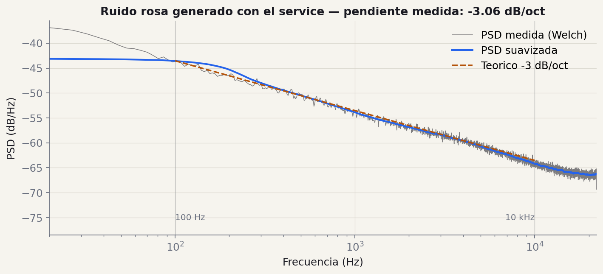
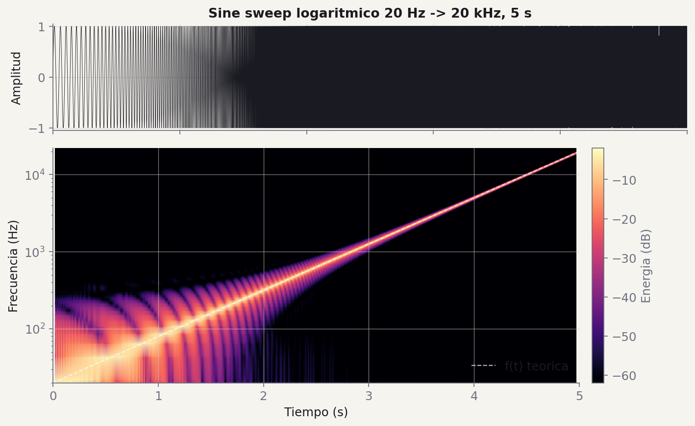
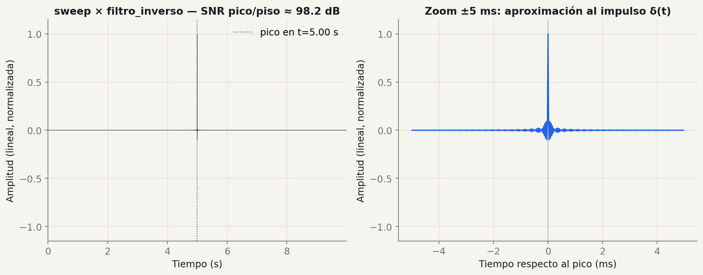

# Milestone 1: Generacion de Senales

!!! info "Fechas y evaluación"
    - **Presentación de la consigna:** miercoles 14 de octubre 2026
    - **Fecha de entrega:** miercoles 28 de octubre 2026 (en clase)
    - **Tag de version:** `v0.1.0`
    - **Evaluación:** seguimiento, sin nota (el grupo muestra su avance y recibe feedback por Slack)

## Objetivo

Implementar las funciones de generacion de senales de excitacion necesarias para mediciones acusticas segun ISO 3382, asi como la funcion de reproduccion y grabacion simultanea. Al finalizar este milestone, el sistema debe ser capaz de generar ruido rosa, sine sweep logaritmico con su filtro inverso, y realizar adquisicion de audio en tiempo real.

---

## Del plano al primer cálculo

En M0 dibujaron las tres capas. En M1 le ponen **código real** a una sola de ellas: `services/`.

Los routers no se tocan todavía. Los schemas tampoco. Solo:

- `services/pink_noise.py`
- `services/sine_sweep.py`
- `services/audio_io.py` (reproducir/grabar)

Cada uno es una *función pura de DSP*: entra `numpy`, sale `numpy`. No saben de HTTP. No saben de JSON. No saben de FastAPI.

!!! note "Por qué importa"
    - Si la función es pura, los tests son triviales
    - Si la función es pura, en M3 la enchufan a una ruta y listo
    - Si la función mezcla cosas, en M2 van a sufrir

    **Regla:** el service no abre archivos, no llama a la red, no imprime. Recibe arrays, devuelve arrays.

## Conceptos y figuras

Lo que hay que entender antes de implementar, con los gráficos de la implementación de referencia de la cátedra.

### Función 01 · ruido rosa

<figure class="figura-tp" markdown>
[](../img/m1/psd_ruido_rosa.png)
<figcaption markdown="span">PSD medida (Welch) vs. teórico -3 dB/oct · pendiente medida sobre la API de cátedra: -3.02 dB/oct</figcaption>
</figure>

El ruido rosa (también llamado ruido $1/f$) se caracteriza por tener una densidad espectral de potencia inversamente proporcional a la frecuencia: $S(f) = k/f$, donde $k$ es una constante. En escala logarítmica esto corresponde a una caída de **-3 dB/octava** (o equivalentemente, -10 dB/década), porque $\Delta L = 10 \log_{10}(1/2) \approx -3{,}01$ dB.

Algoritmo recomendado **Voss-McCartney**: suma de múltiples generadores de ruido blanco que se actualizan a tasas $2^i$. El generador $i$ se actualiza cuando el bit $i$ del índice $n$ cambia. La suma produce una señal cuyo espectro se aproxima a $1/f$. Alternativa aceptable: ruido blanco filtrado en frecuencia con $H(f) = 1/\sqrt{f}$.

<small>Especificación (m1_generacion) §1 — *Voss, R. F. & Clarke, J. (1978). "1/f noise" in music. JASA 63(1).*</small>

### Función 02 · sine sweep logarítmico

<figure class="figura-tp" markdown>
[](../img/m1/sweep_waveform_spec.png)
<figcaption markdown="span">Sweep 20 Hz → 20 kHz, 5 s · línea blanca discontinua = f(t) teórica</figcaption>
</figure>

El sine sweep logarítmico (también llamado exponencial) se define como: $\;x(t) = \sin\!\left[\tfrac{2\pi f_1 T}{\ln(f_2/f_1)}\!\left(e^{t \ln(f_2/f_1)/T} - 1\right)\right]$, con $f_1$ frecuencia inicial, $f_2$ final, $T$ duración total, $0 \leq t \leq T$.

La frecuencia instantánea es $f(t) = f_1 \cdot e^{t \ln(f_2/f_1)/T}$, que crece exponencialmente de $f_1$ a $f_2$. Logarítmico (no lineal) porque buscamos *igual energía por octava* — coincide con la escala de los filtros de bandas IEC 61260 que van a usar en M2.

<small>Especificación (m1_generacion) §2 — *Farina, A. (2000). Simultaneous measurement of impulse response and distortion with a swept-sine technique. 108th AES Convention.*</small>

### Función 02 · filtro inverso

<figure class="figura-tp" markdown>
[](../img/m1/convolucion_impulso.png)
<figcaption markdown="span">Convolución sweep × inverso · pico vs. piso ≈ 98 dB de relación (test pide ≥ 40 dB)</figcaption>
</figure>

El filtro inverso se obtiene invirtiendo temporalmente el sweep y aplicando una corrección de amplitud que compensa la distribución no uniforme de energía por frecuencia del sweep logarítmico: $\;x_{\text{inv}}(t) = x(T - t) / A(t)$, con envolvente $A(t) = e^{-t \ln(f_2/f_1)/T}$.

La corrección es necesaria porque el sweep logarítmico permanece **más tiempo en las frecuencias bajas** y concentra más energía allí. El filtro inverso compensa atenuando esa banda. La convolución del sweep con su filtro inverso debe producir un impulso ideal: $\;x(t) * x_{\text{inv}}(t) \approx \delta(t)$. En la práctica, un pulso estrecho con lóbulos laterales pequeños.

<small>Especificación (m1_generacion) §2 (filtro inverso) — *esto es lo que en M2 usan para deconvolucionar la respuesta al impulso de la sala.*</small>

### Reproducir y grabar en simultáneo

!!! note "Backend · `sounddevice`"
    ```python
    import sounddevice as sd
    recorded = sd.playrec(signal, samplerate=fs, channels=1, blocking=True)
    sd.wait()
    ```

    Hace play + record a la vez sobre el mismo dispositivo, muestra contra muestra. Documenten en el README la config: dispositivo, canales, fs, buffer size.

!!! note "Detalles que rompen mediciones"
    - **Pre-roll** 0.5-1 s — compensa latencia del driver
    - **Grabación > señal** — capturar la cola de reverberación
    - Manejar **mono y estéreo** sin asumir shape
    - Error **informativo** si no hay device

!!! note "Cliente · cómo se hace lo mismo en el navegador (frontend de cátedra)"
    `sd.playrec()` no existe en el browser. La analogía es la **Web Audio API**:

    - `navigator.mediaDevices.getUserMedia({audio: {sampleRate: {ideal: fs}}})` — permiso + micrófono
    - `new AudioContext({sampleRate})` + `AudioBufferSourceNode` — reproduce la señal de excitación
    - `new MediaRecorder(stream, {mimeType: 'audio/webm;codecs=opus'})` — captura el stream
    - Conversión a WAV en cliente con `OfflineAudioContext` antes de subir al backend
    - `setSinkId()` para elegir salida cuando hay múltiples dispositivos

    **Mismos cuidados**: sample rate explícito, manejo de permisos denegados, latencia entre play y record (acá la introduce el browser, no el driver de audio). Grabar en mono para no duplicar el tamaño del archivo subido al backend.

## Funciones a implementar

### 1. `generar_ruido_rosa(duracion, fs)`

**Firma sugerida:**
```python
def generar_ruido_rosa(duracion: float, fs: int) -> np.ndarray:
    """
    Genera ruido rosa utilizando el algoritmo Voss-McCartney.

    Parameters
    ----------
    duracion : float
        Duracion de la senal en segundos.
    fs : int
        Frecuencia de muestreo en Hz.

    Returns
    -------
    np.ndarray
        Array con la senal de ruido rosa normalizada entre -1 y 1.
    """
```

**Fundamento matematico:**

El ruido rosa (tambien llamado ruido $1/f$) se caracteriza por tener una densidad espectral de potencia inversamente proporcional a la frecuencia:

$$S(f) = \frac{k}{f}$$

donde $k$ es una constante. En escala logaritmica, esto corresponde a una caida de **-3 dB/octava** (o equivalentemente, -10 dB/decada).

La relacion en decibeles entre dos frecuencias separadas por una octava ($f_2 = 2 f_1$) es:

$$\Delta L = 10 \log_{10}\left(\frac{S(f_2)}{S(f_1)}\right) = 10 \log_{10}\left(\frac{f_1}{f_2}\right) = 10 \log_{10}\left(\frac{1}{2}\right) \approx -3.01 \text{ dB}$$

**Algoritmo Voss-McCartney:**

El algoritmo genera ruido rosa mediante la suma de multiples generadores de ruido blanco que se actualizan a diferentes tasas. Cada generador $i$ se actualiza cada $2^i$ muestras. La suma de todos los generadores produce una senal cuyo espectro se aproxima a $1/f$.

El procedimiento es:

1. Definir $N_{bits}$ generadores de ruido blanco (tipicamente 16-20).
2. Para cada muestra $n$, determinar cuales generadores deben actualizarse. El generador $i$ se actualiza cuando el bit $i$ de $n$ cambia respecto a $n-1$.
3. Sumar las salidas de todos los generadores.
4. Normalizar la senal resultante.

**Alternativa aceptable:** Tambien se acepta la generacion en el dominio frecuencial, creando ruido blanco y aplicando un filtro con respuesta $H(f) = 1/\sqrt{f}$:

$$X_{rosa}(f) = X_{blanco}(f) \cdot \frac{1}{\sqrt{f}}$$

**Referencia:** Voss, R. F., & Clarke, J. (1978). "1/f noise" in music: Music from 1/f noise. *Journal of the Acoustical Society of America*, 63(1), 258-263.

---

### 2. `generar_sine_sweep(f1, f2, duracion, fs)`

**Firma sugerida:**
```python
def generar_sine_sweep(
    f1: float, f2: float, duracion: float, fs: int
) -> tuple[np.ndarray, np.ndarray]:
    """
    Genera un sine sweep logaritmico y su filtro inverso.

    Parameters
    ----------
    f1 : float
        Frecuencia inicial en Hz.
    f2 : float
        Frecuencia final en Hz.
    duracion : float
        Duracion del sweep en segundos.
    fs : int
        Frecuencia de muestreo en Hz.

    Returns
    -------
    tuple[np.ndarray, np.ndarray]
        Tupla con (sweep, filtro_inverso), ambos normalizados.
    """
```

**Fundamento matematico:**

El sine sweep logaritmico (tambien llamado exponencial) se define como:

$$x(t) = \sin\left[\frac{2\pi f_1 T}{\ln(f_2/f_1)} \left(e^{t \ln(f_2/f_1)/T} - 1\right)\right]$$

donde:
- $f_1$ es la frecuencia inicial (Hz)
- $f_2$ es la frecuencia final (Hz)
- $T$ es la duracion total del sweep (s)
- $t$ es el tiempo, con $0 \leq t \leq T$

La frecuencia instantanea del sweep en el instante $t$ es:

$$f(t) = f_1 \cdot e^{t \ln(f_2/f_1)/T}$$

que crece exponencialmente de $f_1$ a $f_2$.

**Filtro inverso:**

El filtro inverso se obtiene invirtiendo temporalmente el sweep y aplicando una correccion de amplitud que compensa la distribucion no uniforme de energia por frecuencia del sweep logaritmico:

$$x_{inv}(t) = \frac{x(T - t)}{A(t)}$$

donde la envolvente de amplitud es:

$$A(t) = e^{-t \ln(f_2/f_1)/T}$$

Esta correccion es necesaria porque el sweep logaritmico permanece mas tiempo en las frecuencias bajas, concentrando mas energia alli. El filtro inverso compensa esto atenuando las bajas frecuencias.

La convolucion del sweep con su filtro inverso debe producir un impulso (delta de Dirac) ideal:

$$x(t) * x_{inv}(t) \approx \delta(t)$$

En la practica, el resultado sera un pulso estrecho con lobulos laterales pequenos.

**Referencia:** Farina, A. (2000). "Simultaneous measurement of impulse response and distortion with a swept-sine technique." *108th AES Convention*.

---

### 3. `reproducir_y_grabar(signal, fs, duracion_grabacion)`

**Firma sugerida:**
```python
def reproducir_y_grabar(
    signal: np.ndarray, fs: int, duracion_grabacion: float
) -> np.ndarray:
    """
    Reproduce una senal y graba simultaneamente.

    Parameters
    ----------
    signal : np.ndarray
        Senal a reproducir.
    fs : int
        Frecuencia de muestreo en Hz.
    duracion_grabacion : float
        Duracion total de la grabacion en segundos.
        Debe ser >= duracion de la senal para capturar la reverberacion.

    Returns
    -------
    np.ndarray
        Array con la senal grabada.
    """
```

**Consideraciones tecnicas:**

- Utilizar la libreria `sounddevice` con la funcion `sd.playrec()` para reproduccion y grabacion simultanea.
- La `duracion_grabacion` debe ser mayor que la duracion de la senal reproducida para capturar la cola de reverberacion del recinto.
- La funcion debe manejar correctamente senales mono y estereo.
- Se recomienda agregar un silencio inicial (pre-roll) de 0.5-1 s antes de la senal para compensar latencia del sistema de audio.
- La funcion debe verificar que los dispositivos de audio estan disponibles y manejar errores de manera informativa.

**Nota sobre la configuracion de audio:** Cada grupo debera documentar en el README la configuracion de su interfaz de audio (dispositivo, canales, frecuencia de muestreo soportada, buffer size).

---

## Tests requeridos

Todos los tests deben estar en el directorio `tests/` y ejecutarse con `pytest`.

### Test 1: Espectro del ruido rosa

```python
def test_ruido_rosa_espectro():
    """
    Verificar que el espectro del ruido rosa tiene una pendiente
    de aproximadamente -3 dB/octava.
    """
```

**Procedimiento:**
1. Generar ruido rosa de al menos 10 segundos a 44100 Hz.
2. Calcular la PSD (Power Spectral Density) usando el metodo de Welch (`scipy.signal.welch`).
3. Calcular la pendiente en dB/octava entre 100 Hz y 10000 Hz.
4. Verificar que la pendiente esta entre -4 dB/octava y -2 dB/octava (tolerancia de 1 dB/octava respecto al valor teorico de -3 dB/octava).

### Test 2: Rango de frecuencias del sine sweep

```python
def test_sine_sweep_rango_frecuencias():
    """
    Verificar que el sine sweep cubre el rango de frecuencias
    especificado de f1 a f2.
    """
```

**Procedimiento:**
1. Generar un sweep de 20 Hz a 20000 Hz de 5 segundos a 44100 Hz.
2. Calcular el espectrograma de la senal.
3. Verificar que hay energia significativa en las frecuencias inicial y final.
4. Verificar que la frecuencia instantanea crece monotonicamente.

### Test 3: Convolucion sweep * filtro inverso

```python
def test_sweep_convolucion_impulso():
    """
    Verificar que la convolucion del sweep con su filtro inverso
    produce una aproximacion a un impulso.
    """
```

**Procedimiento:**
1. Generar sweep y filtro inverso.
2. Calcular la convolucion (preferiblemente via FFT con `scipy.signal.fftconvolve`).
3. Encontrar el pico maximo de la senal resultante.
4. Verificar que la energia del pico es al menos 40 dB superior a la energia promedio del resto de la senal (excluyendo una ventana alrededor del pico).

### Test 4: Reproduccion y grabacion

```python
def test_reproducir_y_grabar_forma():
    """
    Verificar que la funcion maneja correctamente senales mono y estereo.
    """
```

**Procedimiento:**
1. Verificar que la funcion acepta arrays 1D (mono) y 2D (estereo).
2. Verificar que la grabacion tiene la duracion esperada (numero de muestras = `duracion_grabacion * fs`, con tolerancia del 1%).
3. Verificar que la funcion lanza una excepcion informativa si no hay dispositivo de audio disponible.

**Nota:** Este test puede requerir un mock del dispositivo de audio para ejecutarse en CI. Documentar como ejecutarlo localmente.

---

## Validacion

Ademas de los tests automatizados, cada grupo debe realizar las siguientes validaciones manuales:

1. **Comparacion espectral con Audacity o REW:**
   - Exportar el ruido rosa generado a WAV y abrirlo en Audacity.
   - Analizar el espectro y verificar visualmente la pendiente de -3 dB/octava.
   - Repetir para el sine sweep: verificar que el espectrograma muestra un barrido logaritmico de $f_1$ a $f_2$.

2. **Verificacion de la convolucion:**
   - Graficar el resultado de la convolucion sweep * filtro inverso.
   - El resultado debe parecerse a un impulso con lobulos laterales minimos.
   - Incluir esta grafica en el README del repositorio.

3. **Prueba de reproduccion y grabacion:**
   - Realizar una prueba real con un altavoz y un microfono (puede ser con la PC).
   - Verificar que la senal grabada contiene la senal reproducida.

Incluir capturas de pantalla o graficas de todas las validaciones en la documentacion del milestone.

---

## Calidad de codigo

- **Docstrings**: todas las funciones publicas deben tener docstrings en formato NumPy.
- **Type hints**: todas las funciones deben tener anotaciones de tipos en parametros y retorno.
- **PEP 8**: el codigo debe pasar `ruff check` sin errores.
- **Commits**: usar commits descriptivos y frecuentes. Se evaluara el historial de Git.
- **Pull requests**: cada funcion debe desarrollarse en una rama separada y mergearse via PR con al menos una revision de otro integrante.
- **Tag**: al completar el milestone, crear el tag `v0.1.0` en la rama `main`.

---

## Guía de entrega

### Evidencia en el repositorio

Además de los tests automatizados, cada grupo entrega evidencia visual:

- Espectro del ruido rosa abierto en **Audacity** o REW, con la pendiente visible
- Espectrograma del sweep mostrando el barrido $f_1 \to f_2$
- Gráfica de la convolución sweep × inverso (debe parecer un impulso)
- Prueba real con altavoz + micrófono (puede ser la PC)

Capturas o PNGs van en `docs/m1/` del repo.

!!! note "Referencia visual"
    Comparen contra los gráficos de las funciones 01 y 02 de esta página. Las pendientes y SNRs deberían estar en el mismo orden.

    - Ruido rosa: -3 ± 1 dB/oct
    - Sweep: barrido monótono visible
    - Convolución: pico claro > 40 dB sobre el piso

    Si su resultado se ve muy distinto a las imágenes de cátedra, hay un bug — empiecen por ahí.

### Buenas prácticas que ya vimos funcionar

Patrones aplicados en la API de cátedra. No los pide la rúbrica — pero les ahorran trabajo en M2 y M3.

!!! note "01 · Devolver dict, no solo el array"
    Junto al `audio_data`, devolver `file_path`, `sample_rate`, `num_samples`, `max_amplitude`. Mismo dict se serializa como JSON en M3 sin retrabajo.

!!! note "02 · Normalizar al 90% del máximo"
    `signal = signal / max(|signal|) * 0.9`  
     Deja headroom para evitar clipping al guardar WAV o reproducir. Multiplicar por `1.0` y rezar no es estrategia.

!!! note "03 · Descartar el transitorio del filtro IIR"
    Si usan `scipy.signal.lfilter`, generar `N + nt60` muestras y tirar las primeras `nt60`. Si no, los primeros milisegundos están sucios.

!!! note "04 · Generación ≠ Plotting"
    `pink_noise.py` genera. `signal_utils.py` grafica. Funciones distintas, archivos distintos. Si mañana cambian el plot, no rompen el generador.

!!! note "05 · `output_path` opcional"
    Default a `tempfile`, no al cwd del que llama. Tests no ensucian el repo; M3 puede generar WAV efímeros para la response.

!!! note "06 · Dos implementaciones, mismo test"
    Voss-McCartney y filtro IIR son ambos válidos. El test es el contrato — no la implementación. Esto les da margen de optimizar después sin romper nada.

### Lo que mira el docente

**Código**

- [ ] Docstrings NumPy en toda función pública
- [ ] Type hints en parámetros y retorno
- [ ] Tests en `tests/` que pasen al correr `pytest -v`
- [ ] Imports limpios, sin código muerto

**Git**

- [ ] Cada función en una rama propia
- [ ] Merge a `main` vía PR con review de otro integrante
- [ ] Historial coherente (no un commit gigante "M1")
- [ ] Tag `v0.1.0` anotado y empujado al remote

!!! note "Recordatorio · cómo correr los tests"
    ```bash
    # desde la raiz del repo
    uv sync                              # asegurar dependencias instaladas
    uv run pytest -v                     # correr todos los tests con output verboso
    uv run pytest -v tests/test_pink.py  # correr solo un archivo
    uv run pytest -v -k "ruido_rosa"     # correr tests que matchean el nombre
    ```

    `-v` (verbose) muestra cada test con su nombre y si pasó; sin `-v` solo ven puntos. `-k` filtra tests por substring del nombre — útil para correr solo lo que estás tocando. Si un test falla, `pytest --pdb` abre el debugger en el punto exacto de la falla, y `pytest -x` detiene la corrida en el primer fallo.

### Checklist de entrega

Lo que tiene que estar en el tag `v0.1.0` el 28/10.

- [ ] `generar_ruido_rosa` con test pasando
- [ ] `generar_sine_sweep` + filtro inverso con tests pasando
- [ ] `reproducir_y_grabar` con test de forma
- [ ] Las 3 gráficas de validación en `docs/m1/`

- [ ] `pytest -v` en verde — los 4 tests requeridos
- [ ] Docstrings y type hints en las 3 funciones públicas
- [ ] PRs mergeados, no commits directos a `main`
- [ ] Tag `v0.1.0` anotado y empujado al remote

Ocho checks. Si están, presentan tranquilos.

## Recursos

- [sounddevice: documentacion](https://python-sounddevice.readthedocs.io/)
- [scipy.signal.welch](https://docs.scipy.org/doc/scipy/reference/generated/scipy.signal.welch.html)
- [Farina, A. (2000) - Swept-sine technique (PDF)](http://pcfarina.eng.unipr.it/Public/Papers/134-AES00.PDF)
- [Voss-McCartney algorithm](https://www.firstpr.com.au/dsp/pink-noise/)
- [Audacity: analisis espectral](https://manual.audacityteam.org/man/plot_spectrum.html)
