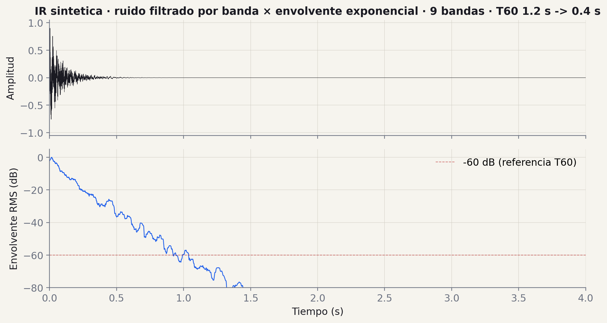
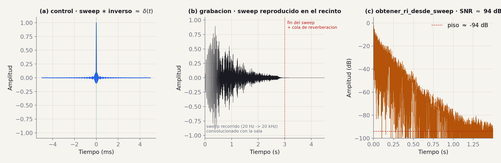
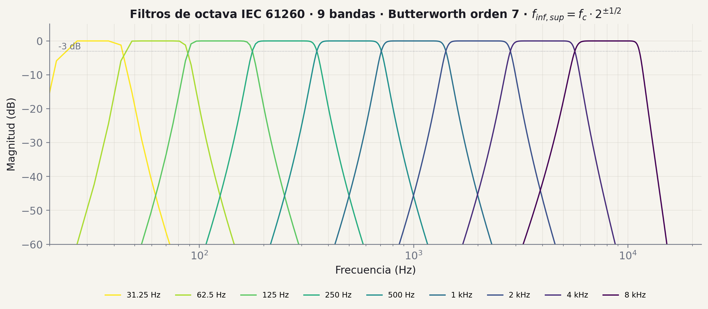
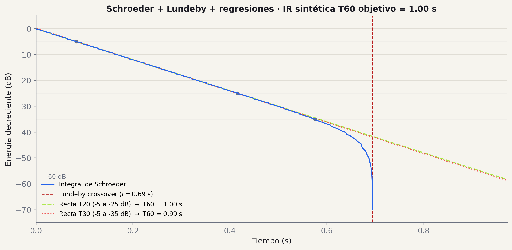
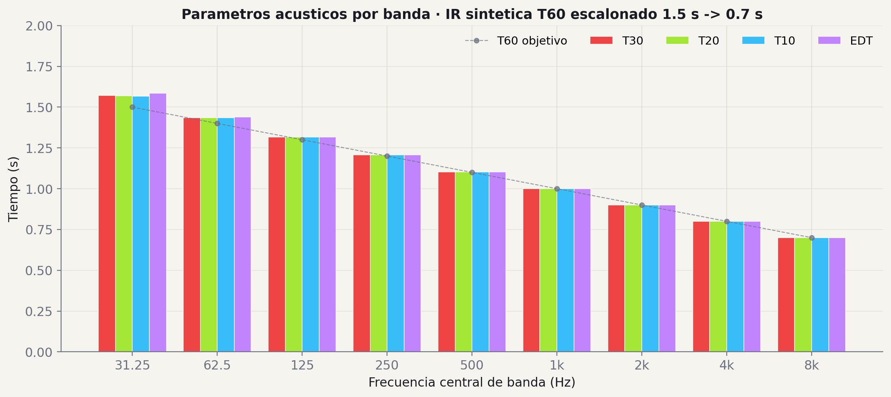

# Milestone 2: Procesamiento de la Respuesta al Impulso

!!! info "Fechas y evaluación"
    - **Presentación de la consigna:** miercoles 21 de octubre 2026
    - **Fecha de entrega:** miercoles 4 de noviembre 2026 (sesión virtual)
    - **Tag de version:** `v0.2.0`
    - **Evaluación:** seguimiento, sin nota (el grupo muestra su avance y recibe feedback por Slack)

## Objetivo

Implementar las funciones de procesamiento de la respuesta al impulso (RI): carga de archivos de audio, sintesis de RI conocidas para validacion, deconvolucion, filtrado por bandas de octava y conversion a escala logaritmica. Al finalizar este milestone, el sistema debe ser capaz de obtener la RI a partir de una grabacion de sine sweep y procesarla en bandas de frecuencia.

---

## Del estímulo al parámetro

En M1 generaron las señales que *excitan* la sala. En M2 las usan para extraer la **respuesta al impulso real** y, sobre esa RI, calculan los parámetros acústicos **por banda**.

El flujo nuevo:

- Cargar un WAV grabado en la sala
- (Opcional) sintetizar una RI de prueba con T60 conocidos
- Deconvolucionar para obtener la RI desde una grabación de sweep
- Filtrar en bandas de octava (IEC 61260)
- Llevar todo a escala logarítmica para el análisis

!!! note "De qué clases viene"
    **Clase 9 · Frecuencia y Filtros** — FFT, ventanas, espectrogramas, Butterworth FIR/IIR, bandas IEC 61260. Es el fundamento de `filtro_octava()`.

    **Clase 10 · Procesamiento de la RI** — Transformada de Hilbert, envolvente, suavizado, integral de Schroeder, regresión por mínimos cuadrados. Es el puente al cálculo de T60 (que viene en M3).

    Si esas dos clases las tienen frescas, M2 se resuelve casi por composición.

## Conceptos y figuras

Lo que hay que entender antes de implementar, con los gráficos de la implementación de referencia de la cátedra.

### El punto de entrada

Cargar un WAV o FLAC y devolver **(señal, fs)** normalizado entre -1 y 1.

Detalles que no son obvios:

- Soporte mono *y* estéreo (acá ya pueden convertir a mono haciendo `mean(axis=1)`)
- Validar la extensión antes de leer — no es lo mismo un .wav corrupto que un .mp3 mal etiquetado
- El `fs` sale del header del archivo — nunca lo asuman
- Normalizar al máximo absoluto evita que un archivo grabado con poco nivel les arruine los plots después

!!! note "Caso real · OpenAIR"
    Para la validación manual van a usar IRs de **OpenAIR** (catálogo público). Vienen en variedad de sample rates (44.1, 48, 96 kHz) y resoluciones (16 o 24 bit).

    Si su `cargar_audio` hace asunciones, se rompe en el primer archivo de ahí.

    Recomendación: `soundfile.read()` (más robusto que `scipy.io.wavfile`) y siempre revisar `signal.shape` antes de usarla.

### Función 02 · sintetizar RI

<figure class="figura-tp" markdown>
[](../img/m2/ri_sintetica.png)
<figcaption markdown="span">IR sintética 4 s · 9 bandas de octava · T60 1.2 s (graves) → 0.4 s (agudos) · ruido filtrado × envolvente exponencial</figcaption>
</figure>

Una RI idealizada de un recinto se modela como un **decaimiento exponencial modulado por ruido**. Por banda: tomar ruido blanco, filtrar pasa-banda en la octava, y multiplicar por una envolvente $e^{-\alpha t}$ con $\alpha$ derivado del T60 objetivo:

$$
h_i(t) = n_i(t) \cdot e^{-\alpha_i\, t}, \quad \alpha_i = \frac{3 \ln(10)}{T_{60,i}} \approx \frac{6{,}908}{T_{60,i}}, \quad h(t) = \sum_i h_i(t)
$$

$n_i(t)$ es *ruido blanco filtrado por banda* con Butterworth pasa-banda IEC 61260 ($f_c / \sqrt{2}$ a $f_c \cdot \sqrt{2}$). El factor $\alpha = 6{,}908 / T_{60}$ sale de pedir $20 \log_{10}(e^{-\alpha T_{60}}) = -60$ dB. Suma las 9 bandas y normaliza al pico. **Tip:** normalizar cada banda por su RMS antes de aplicar la envolvente — sin eso, las bandas más anchas (agudas) dominan la mezcla.

<small>Especificación (m2_procesamiento) §2 — el caracter de "ruido decayente" se ve en el waveform; la envolvente RMS de la derecha cae linealmente en dB hasta cerca de $-60$ dB en $\approx T_{60}$ promedio.</small>

### Función 03 · deconvolución

<figure class="figura-tp" markdown>
[](../img/m2/deconvolucion_ri.png)
<figcaption markdown="span">(a) control · sweep $\ast$ inverso $\approx \delta(t)$ · (b) grabación del recinto · (c) `obtener_ri_desde_sweep(grabacion, filtro_inverso)`</figcaption>
</figure>

<div class="audios-tp">
<div><strong>01 · sweep estimulo (3 s)</strong><br><audio controls preload="none" src="../audio/m2/sweep_estimulo.wav"></audio></div>
<div><strong>02 · grabacion del recinto (4.5 s)</strong><br><audio controls preload="none" src="../audio/m2/grabacion_recinto.wav"></audio></div>
<div><strong>03 · RI recuperada (1.5 s)</strong><br><audio controls preload="none" src="../audio/m2/ri_recuperada.wav"></audio></div>
</div>

**En el recinto** tienen tres cosas: el sweep sintético que *reproducen*, el filtro inverso sintético del mismo sweep (que *guardan*, lo conocen porque lo generaron en M1), y la *grabación* que entra por el micrófono. La respuesta al impulso de la sala $h(t)$ **no la conocen** — es lo que quieren extraer.

Algebra del flujo: si $y(t) = x(t) * h(t)$ es la grabación, convolucionando con $x_{\text{inv}}$:

$$
y(t) * x_{\text{inv}}(t) = (x * h) * x_{\text{inv}} = h(t) * (x * x_{\text{inv}}) \approx h(t) * \delta(t) = h(t)
$$

La firma de la spec es `obtener_ri_desde_sweep(grabacion, filtro_inverso)`. Implementación: `scipy.signal.fftconvolve(grabacion, filtro_inverso, mode='full')`, ubicar el pico con `np.argmax(np.abs(...))` y recortar la cola. `fftconvolve` es órdenes de magnitud más rápido que `convolve` para señales largas (la grabación típica son ~3-5 s a 48 kHz).

<small>Especificación (m2_procesamiento) §3 — Farina (2000). Test: correlación cruzada con la RI original > 0.9. En el panel (b) la $h_\text{sala}$ está simulada con el modelo de la spec (ruido $\times$ envolvente) para poder mostrar el flujo completo sin grabar realmente.</small>

### ¿Por qué funciona la deconvolución?

Cuatro pasos. Cada uno se apoya en el anterior.

!!! note "01 · La sala es LTI"
    Asumimos linealidad e invariancia en el tiempo. Bajo esa hipótesis la sala queda caracterizada por una sola función: su **respuesta al impulso** $h(t)$. Para cualquier entrada $x(t)$:

    $$
    y(t) = (x * h)(t)
    $$

!!! note "02 · El sueño: meter un $\delta$"
    Como $\delta * h = h$, si pudieras reproducir un impulso perfecto la grabación *sería* $h(t)$. El parlante no puede — $\delta$ tiene amplitud infinita. Una palmada se aproxima pero el SNR es malo en graves.

!!! note "03 · El truco · sweep + inverso"
    Generaste en M1 dos señales con esta propiedad (Farina 2000):

    $$
    x(t) * x_{\text{inv}}(t) \approx \delta(t)
    $$

    Cada frecuencia del sweep se apila en $t=0$ al convolucionar con su pareja invertida.

!!! note "04 · La cadena"
    Reproducís $x$, grabás $y = x * h$. Convolucionás con $x_{\text{inv}}$ (que también conocés). Aplicando asociatividad:

    $$
    y * x_{\text{inv}} = (x * h) * x_{\text{inv}} = h * (x * x_{\text{inv}}) \approx h
    $$

### En frecuencia se ve más claro

El teorema de convolución dice que convolución en el tiempo $=$ multiplicación en frecuencia. La conmutatividad/asociatividad de la convolución vienen de las del producto de números complejos.

Aplicado a la cadena:

$$
\mathcal{F}\{y * x_{\text{inv}}\} = Y(f)\cdot X_{\text{inv}}(f)
$$

$$
= X(f)\, H(f)\, X_{\text{inv}}(f) = H(f)\,\underbrace{X(f)\, X_{\text{inv}}(f)}_{\approx\,1}
$$

Inversa de Fourier → recuperás $h(t)$. La propiedad de Farina del sweep es exactamente que $X(f) \cdot X_{\text{inv}}(f) \approx 1$ en toda la banda útil.

!!! note "Resumen operacional"
    | Qué tenés | De dónde sale |
    |---|---|
    | `x(t)` · sweep | M1 — `generar_sine_sweep(inv=False)` |
    | `x_inv(t)` · inverso | M1 — `generar_sine_sweep(inv=True)` |
    | `y(t)` · grabación | el micrófono en la sala |
    | `h(t)` · RI | `obtener_ri_desde_sweep(y, x_inv)` |

    Tres entradas conocidas, una salida deseada. La función de M2 es una sola línea: `scipy.signal.fftconvolve(grabacion, filtro_inverso, mode='full')` más ubicar el pico y recortar.

> **Material extendido:** [Álgebra de la deconvolución](m2_algebra_deconvolucion.md) — derivación detallada de las propiedades, comparación con MLS, implementación paso a paso, referencias.

### Función 04 · filtro_octava(signal, fc, fs, orden)

<figure class="figura-tp" markdown>
[](../img/m2/filtros_octava.png)
<figcaption markdown="span">Butterworth pasa-banda · IEC 61260 · 9 bandas mostradas (31,5 Hz–8 kHz · la décima a 16 kHz cae fuera de Nyquist a 44,1 kHz)</figcaption>
</figure>

Norma **IEC 61260**: $f_\text{inf} = f_c \cdot 2^{-1/2}$, $f_\text{sup} = f_c \cdot 2^{1/2}$. 10 bandas estándar de octava (la última excede Nyquist a 44,1 kHz).

| banda | $f_c$ (Hz) | $f_\text{inf}$ - $f_\text{sup}$ (Hz) |
|---|---|---|
| 1 | 31,5 | 22,3 - 44,5 |
| 2 | 63 | 44,5 - 89,1 |
| 3 | 125 | 88,4 - 176,8 |
| 4 | 250 | 176,8 - 353,6 |
| 5 | 500 | 353,6 - 707,1 |
| 6 | 1 000 | 707,1 - 1 414,2 |
| 7 | 2 000 | 1 414,2 - 2 828,4 |
| 8 | 4 000 | 2 828,4 - 5 656,9 |
| 9 | 8 000 | 5 656,9 - 11 313,7 |
| 10 | 16 000 | 11 313,7 - 22 627,4 |

!!! note "Implementación (spec §4)"
    ```python
    import numpy as np
    import scipy.signal

    def filtro_octava(signal, fc, fs, orden=4):
        f_inf = fc / np.sqrt(2)
        f_sup = fc * np.sqrt(2)
        # frecuencias normalizadas a Nyquist
        W_inf = 2 * f_inf / fs
        W_sup = 2 * f_sup / fs
        b, a = scipy.signal.butter(orden, [W_inf, W_sup], btype='band')
        return scipy.signal.filtfilt(b, a, signal)
    ```

    Para órdenes altos (>6) podés usar `output='sos'` + `sosfiltfilt` — más estable numéricamente.

!!! note "`filtfilt`, no `lfilter`"
    Aplica el filtro *forward + backward* → fase **cero**. Crítico para parámetros temporales (EDT, T60). Sin esto, el retardo de grupo desplaza el inicio del decaimiento por banda y T60 en graves sale 5–15% inflado.

### De lineal a dB

Convertir la amplitud a dB relativos al máximo es lo que permite ver el decaimiento real de la RI — en lineal, casi todo se ve "pegado a cero".

$$
L(t) = 20 \cdot \log_{10}\!\left(\frac{|h(t)|}{\max |h(t)|}\right)
$$

Detalles que no aparecen en la fórmula pero rompen la implementación:

- **Reemplazar ceros antes del log**: $\log_{10}(0) = -\infty$. La spec sugiere `np.finfo(float).eps` (≈ $2{,}2 \times 10^{-16}$, la mínima resolución de `float`).
- **Piso de ruido opcional**: clipear a -120 dB *después* del log para que el plot no se vaya muy bajo.
- **Normalización al máximo**: el resultado siempre tiene 0 dB como pico.

!!! note "Implementación (spec §5)"
    ```python
    import numpy as np

    def a_escala_log(signal):
        # 1. Reemplazar ceros para evitar log(0) = -inf
        safe = np.where(signal == 0, np.finfo(float).eps, np.abs(signal))
        # 2. Normalizar al maximo y convertir a dB
        return 20 * np.log10(safe / np.max(safe))
    ```

    La spec también acepta dejar los `-np.inf` resultantes sin reemplazar. Ambas opciones son válidas — la diferencia es solo cosmética en el plot.

!!! note "Cuándo sirve"
    - Visualizar el decaimiento como *recta* — la pendiente se ve directa.
    - Calcular T60 vía regresión lineal (método ISO 3382, viene en M3).
    - Comparar rango dinámico real de una IR contra el piso de ruido.

### Puente conceptual

<figure class="figura-tp" markdown>
[](../img/m2/schroeder_lundeby.png)
<figcaption markdown="span">Integral de Schroeder · crossover Lundeby · regresiones para T20 y T30 sobre IR sintética T60 = 1.0 s</figcaption>
</figure>

Esta no es una función que pide M2 — pero es el **siguiente paso natural**: una vez que tienen la RI filtrada por banda y en escala log, lo que viene es medir el T60. Y eso requiere dos cosas que vieron en clase 10:

**Integral de Schroeder** · transforma la RI ruidosa en una curva monótona decreciente que es directamente la energía residual desde $t$ en adelante: $S(t) = \int_t^\infty h^2(\tau)\, d\tau$. Se calcula al revés con cumsum invertido. La pendiente de $10 \log_{10} S(t)$ es lo que se usa para extrapolar a -60 dB.

**Método de Lundeby** · detecta el *punto de cruce* entre el decaimiento real y el ruido de fondo. Sin esto, el T60 sale inflado por el ruido residual de la cola. En el plot, la línea roja vertical marca exactamente ese cutoff.

<small>Clase 10 · M3 cierra el círculo: combinan Schroeder + Lundeby + regresión lineal para calcular T30/T20/T10/EDT por banda.</small>

### Adelanto a M3

<figure class="figura-tp" markdown>
[](../img/m2/t30_por_banda.png)
<figcaption markdown="span">Parámetros acústicos por banda · paleta del frontend de cátedra (T30 rojo, T20 lima, T10 cyan, EDT púrpura) · objetivo T60 escalonado</figcaption>
</figure>

Este es el **output final** del análisis acústico, donde van a llegar en M3. Cuatro parámetros por banda según ISO 3382:

- **EDT** (Early Decay Time) — pendiente entre 0 y -10 dB · sensible a las primeras reflexiones
- **T10** — entre -5 y -15 dB, extrapolado a -60 dB
- **T20** — entre -5 y -25 dB, extrapolado a -60 dB
- **T30** — entre -5 y -35 dB, extrapolado a -60 dB · es el estándar

La paleta es la *misma* que van a ver en el frontend de cátedra cuando suban su WAV — continuidad visual entre presentación, app y README. `T30 = T20 ≈ T10 ≈ EDT` indica un decaimiento limpio (sala bien comportada). Si difieren mucho, la IR tiene reflexiones tempranas fuertes o ruido de fondo alto.

<small>Spec ISO 3382 · M3 implementa el cálculo · M2 deja todo listo para ese cálculo (filtros por banda + escala log).</small>

### El frontend de cátedra

Una herramienta web para comparar sus resultados contra los de la cátedra *en vivo*.

https://rir-api-frontend.onrender.com

!!! note "Analizador"
    Suben un WAV de una RI (la que sintetizaron con su `sintetizar_ri`, o una de OpenAIR) y la app calcula:

    - SNR · cutoff Lundeby · ratio EDT/T30
    - T30/T20/T10/EDT por banda con la gráfica de la sección anterior
    - Tabla completa de valores por banda

!!! note "Generador"
    Ruido rosa, sine sweep + filtro inverso, RI sintética, convolución. Útil para generar la grabación de prueba si no tienen una sala disponible.

!!! note "Grabador"
    Captura directa desde el navegador con Web Audio API. Pueden grabar una palmada y obtener una RI cruda para procesar.

> **Tip M2:** sinteticen una RI con T60 conocidos, súbanla al Analizador, comparen los valores que devuelve contra los que pusieron como entrada. Si difieren mucho, hay bug.

## Funciones a implementar

### 1. `cargar_audio(ruta)`

**Firma sugerida:**
```python
def cargar_audio(ruta: str | Path) -> tuple[np.ndarray, int]:
    """
    Carga un archivo de audio WAV o FLAC.

    Parameters
    ----------
    ruta : str | Path
        Ruta al archivo de audio.

    Returns
    -------
    tuple[np.ndarray, int]
        Tupla con (senal, frecuencia_de_muestreo).
        La senal se devuelve como float64 normalizada entre -1 y 1.

    Raises
    ------
    FileNotFoundError
        Si el archivo no existe.
    ValueError
        Si el formato no es soportado.
    """
```

**Consideraciones:**
- Soportar al menos los formatos WAV y FLAC.
- Utilizar `soundfile` o `scipy.io.wavfile` para la carga.
- Convertir automaticamente a float64 normalizado independientemente de la profundidad de bits original (16-bit, 24-bit, 32-bit).
- Si el audio es estereo, devolver ambos canales y documentar la convencion (filas vs. columnas).
- Incluir manejo de errores robusto con mensajes claros.

---

### 2. `sintetizar_ri(t60_por_banda, fs, duracion)`

**Firma sugerida:**
```python
def sintetizar_ri(
    t60_por_banda: dict[float, float], fs: int, duracion: float
) -> np.ndarray:
    """
    Sintetiza una respuesta al impulso con valores de T60 conocidos por banda.

    Parameters
    ----------
    t60_por_banda : dict[float, float]
        Diccionario {frecuencia_central_Hz: T60_segundos}.
        Ejemplo: {125: 2.0, 250: 1.8, 500: 1.5, 1000: 1.2, 2000: 1.0, 4000: 0.8}
    fs : int
        Frecuencia de muestreo en Hz.
    duracion : float
        Duracion total de la RI sintetizada en segundos.

    Returns
    -------
    np.ndarray
        Respuesta al impulso sintetizada.
    """
```

**Fundamento matematico:**

Una respuesta al impulso idealizada en un recinto puede modelarse como un decaimiento exponencial modulado por ruido:

$$h(t) = n(t) \cdot e^{-\alpha t}$$

donde $n(t)$ es ruido blanco gaussiano y $\alpha$ es la constante de decaimiento relacionada con el tiempo de reverberacion $T_{60}$:

$$\alpha = \frac{3 \ln(10)}{T_{60}} = \frac{6.908}{T_{60}}$$

Esta relacion se deriva de la definicion de $T_{60}$ como el tiempo en que la energia decae 60 dB:

$$20 \log_{10}(e^{-\alpha T_{60}}) = -60 \text{ dB}$$

$$-\alpha T_{60} \cdot 20 \log_{10}(e) = -60$$

$$\alpha = \frac{60}{T_{60} \cdot 20 \log_{10}(e)} = \frac{3\ln(10)}{T_{60}}$$

**Procedimiento de sintesis multi-banda:**

1. Para cada banda de frecuencia en `t60_por_banda`:
   a. Generar ruido blanco de duracion `duracion`.
   b. Filtrar con filtro pasa-banda centrado en la frecuencia central (usar `filtro_octava` del punto 4).
   c. Aplicar la envolvente exponencial con el $\alpha$ correspondiente al $T_{60}$ de esa banda.
2. Sumar todas las componentes filtradas.
3. Normalizar la senal resultante.

**Uso principal:** Esta funcion sirve como referencia para validar que las funciones de calculo de parametros acusticos (M3) devuelven los valores correctos, ya que los $T_{60}$ de entrada son conocidos.

---

### 3. `obtener_ri_desde_sweep(grabacion, filtro_inverso)`

**Firma sugerida:**
```python
def obtener_ri_desde_sweep(
    grabacion: np.ndarray, filtro_inverso: np.ndarray
) -> np.ndarray:
    """
    Obtiene la respuesta al impulso mediante deconvolucion.

    Parameters
    ----------
    grabacion : np.ndarray
        Senal grabada que contiene la respuesta del recinto al sweep.
    filtro_inverso : np.ndarray
        Filtro inverso del sweep utilizado en la excitacion.

    Returns
    -------
    np.ndarray
        Respuesta al impulso del recinto.
    """
```

**Fundamento matematico:**

Si excitamos un sistema lineal e invariante en el tiempo (LTI) con un sine sweep $x(t)$, la respuesta grabada es:

$$y(t) = x(t) * h(t)$$

donde $h(t)$ es la respuesta al impulso del recinto y $*$ denota convolucion.

Para recuperar $h(t)$, convolucionamos la grabacion con el filtro inverso $x_{inv}(t)$:

$$h(t) = y(t) * x_{inv}(t) = [x(t) * h(t)] * x_{inv}(t) = [x(t) * x_{inv}(t)] * h(t) \approx \delta(t) * h(t) = h(t)$$

**Implementacion via FFT:**

La convolucion se realiza eficientemente en el dominio frecuencial:

$$H(f) = Y(f) \cdot X_{inv}(f)$$

$$h(t) = \mathcal{F}^{-1}\{H(f)\}$$

Usar `scipy.signal.fftconvolve` con `mode='full'` y luego recortar la senal al rango relevante.

**Post-procesamiento:**
- Identificar el pico principal de la RI (instante de llegada directa).
- Recortar la senal para que comience en el pico o ligeramente antes.
- Normalizar respecto al pico.

---

### 4. `filtro_octava(signal, fc, fs, orden)`

**Firma sugerida:**
```python
def filtro_octava(
    signal: np.ndarray, fc: float, fs: int, orden: int = 4
) -> np.ndarray:
    """
    Aplica un filtro pasa-banda de octava segun IEC 61260.

    Parameters
    ----------
    signal : np.ndarray
        Senal de entrada.
    fc : float
        Frecuencia central de la banda en Hz.
    fs : int
        Frecuencia de muestreo en Hz.
    orden : int, optional
        Orden del filtro Butterworth (default: 4).

    Returns
    -------
    np.ndarray
        Senal filtrada en la banda de octava especificada.
    """
```

**Fundamento matematico:**

Segun la norma **IEC 61260**, las frecuencias de corte de un filtro de banda de octava se definen como:

$$f_{inf} = \frac{f_c}{\sqrt{2}} = f_c \cdot 2^{-1/2}$$

$$f_{sup} = f_c \cdot \sqrt{2} = f_c \cdot 2^{1/2}$$

donde $f_c$ es la frecuencia central nominal.

Las frecuencias centrales normalizadas de las bandas de octava son:

| Banda | $f_c$ (Hz) | $f_{inf}$ (Hz) | $f_{sup}$ (Hz) |
|-------|-----------|----------------|----------------|
| 1     | 31.5      | 22.3           | 44.5           |
| 2     | 63        | 44.5           | 89.1           |
| 3     | 125       | 88.4           | 176.8          |
| 4     | 250       | 176.8          | 353.6          |
| 5     | 500       | 353.6          | 707.1          |
| 6     | 1000      | 707.1          | 1414.2         |
| 7     | 2000      | 1414.2         | 2828.4         |
| 8     | 4000      | 2828.4         | 5656.9         |
| 9     | 8000      | 5656.9         | 11313.7        |
| 10    | 16000     | 11313.7        | 22627.4        |

**Implementacion:**

1. Calcular las frecuencias de corte normalizadas para el filtro digital:
   $$W_{inf} = \frac{2 f_{inf}}{f_s}, \quad W_{sup} = \frac{2 f_{sup}}{f_s}$$

2. Disenar un filtro Butterworth pasa-banda con `scipy.signal.butter`:
   ```python
   b, a = scipy.signal.butter(orden, [W_inf, W_sup], btype='band')
   ```

3. Aplicar el filtro con `scipy.signal.filtfilt` para obtener fase cero (filtra en ambas direcciones):
   ```python
   signal_filtrada = scipy.signal.filtfilt(b, a, signal)
   ```

**Importante:** Usar `filtfilt` en lugar de `lfilter` para evitar distorsion de fase, lo cual es critico para el calculo correcto de parametros temporales como EDT y $T_{60}$.

**Verificacion:** El espectro del filtro debe cumplir que la atenuacion en las frecuencias de corte es de -3 dB respecto al maximo.

---

### 5. `a_escala_log(signal)`

**Firma sugerida:**
```python
def a_escala_log(signal: np.ndarray) -> np.ndarray:
    """
    Convierte una senal a escala logaritmica normalizada (dB).

    Parameters
    ----------
    signal : np.ndarray
        Senal de entrada (valores lineales).

    Returns
    -------
    np.ndarray
        Senal en decibeles, normalizada respecto al valor maximo.
    """
```

**Fundamento matematico:**

La conversion a escala logaritmica normalizada se define como:

$$L(t) = 10 \log_{10}\left(\frac{h^2(t)}{\max(h^2(t))}\right)$$

O equivalentemente, trabajando con amplitud:

$$L(t) = 20 \log_{10}\left(\frac{|h(t)|}{\max(|h(t)|)}\right)$$

El resultado es una senal en dB donde el valor maximo es 0 dB.

**Consideraciones de implementacion:**
- Evitar logaritmo de cero: reemplazar valores cero o negativos por un valor minimo (por ejemplo, `np.finfo(float).eps` o `-np.inf` en dB).
- Opcionalmente, establecer un piso de ruido (floor) en dB, por ejemplo -120 dB, para evitar valores extremadamente negativos.

---

## Tests requeridos

### Test 1: Carga de audio

```python
def test_cargar_audio_wav():
    """Verificar carga correcta de archivo WAV."""

def test_cargar_audio_formato_invalido():
    """Verificar que lanza error con formato no soportado."""

def test_cargar_audio_normalizacion():
    """Verificar que la salida esta normalizada entre -1 y 1."""
```

### Test 2: Sintesis de RI

```python
def test_sintetizar_ri_duracion():
    """Verificar que la RI tiene la duracion correcta."""

def test_sintetizar_ri_decaimiento():
    """
    Verificar que el decaimiento por banda corresponde
    aproximadamente al T60 especificado.
    """
```

**Procedimiento del test de decaimiento:**
1. Sintetizar una RI con $T_{60} = 2.0$ s en la banda de 1000 Hz.
2. Filtrar la RI sintetizada en la banda de 1000 Hz.
3. Calcular la curva de decaimiento en dB.
4. Medir el tiempo en que la curva cruza -60 dB.
5. Verificar que el $T_{60}$ medido esta dentro del 10% del valor especificado.

### Test 3: Deconvolucion

```python
def test_obtener_ri_pico():
    """
    Verificar que la RI obtenida por deconvolucion tiene
    un pico principal claramente identificable.
    """
```

**Procedimiento:**
1. Generar un sweep y su filtro inverso (M1).
2. Convolucionar el sweep con una RI sintetizada conocida para simular una grabacion.
3. Aplicar `obtener_ri_desde_sweep` con la grabacion simulada y el filtro inverso.
4. Verificar que la RI recuperada se parece a la RI original (correlacion cruzada > 0.9).

### Test 4: Filtro de octava

```python
def test_filtro_octava_frecuencia_central():
    """Verificar que el filtro pasa correctamente la frecuencia central."""

def test_filtro_octava_atenuacion():
    """Verificar atenuacion fuera de banda."""

def test_filtro_octava_respuesta_frecuencia():
    """Verificar que la respuesta cumple -3 dB en frecuencias de corte."""
```

**Procedimiento del test de respuesta en frecuencia:**
1. Calcular la respuesta en frecuencia del filtro con `scipy.signal.freqz`.
2. Verificar que la ganancia en $f_c$ es maxima (0 dB, con tolerancia de 0.5 dB).
3. Verificar que la ganancia en $f_{inf}$ y $f_{sup}$ es aproximadamente -3 dB (tolerancia de 1 dB).
4. Verificar que la atenuacion a una octava de distancia ($f_c/2$ y $2 f_c$) es mayor a 20 dB.

### Test 5: Escala logaritmica

```python
def test_a_escala_log_maximo_cero():
    """Verificar que el valor maximo de la salida es 0 dB."""

def test_a_escala_log_relacion():
    """Verificar que una senal con amplitud mitad da -6 dB."""
```

---

## Dataset de validacion

Para validar el procesamiento, utilizar respuestas al impulso de la base de datos **OpenAIR** (Open Acoustic Impulse Response Library):

- **URL**: [https://www.openairlib.net/](https://www.openairlib.net/)
- **RIs recomendadas para testing:**
  - Elveden Hall, Suffolk, England (sala grande, T60 largo)
  - Maes Howe, Orkney, Scotland (recinto pequeno, T60 corto)
  - Hamilton Mausoleum, Scotland (T60 extremadamente largo, ~15 s)
  - Arthur Sykes Rymer Auditorium, University of York (auditorio tipico)

**Procedimiento de validacion:**
1. Descargar al menos 2 RIs de OpenAIR.
2. Procesarlas con las funciones desarrolladas.
3. Comparar los resultados (espectro, forma de onda, decaimiento) con los valores reportados en la base de datos.
4. Documentar la comparacion en el README del repositorio.

**Validacion con software comercial:**
- Procesar las mismas RIs con software de referencia: **REW (Room EQ Wizard)**, **ARTA**, **Aurora Plugins** o similar.
- Los resultados no deben diferir significativamente (se evaluara en detalle en M3).

---

## Calidad de codigo

Todos los requisitos de M1 aplican, mas los siguientes:

- **Modularidad**: cada funcion debe estar en un modulo separado o agrupada logicamente dentro de la capa de servicios. Ejemplo:
  ```
  app/
  ├── services/
  │   ├── __init__.py
  │   ├── pink_noise.py       # M1
  │   ├── sine_sweep.py       # M1
  │   ├── signal_utils.py     # M2
  │   ├── filter.py           # M2
  │   └── acoustic_parameters.py  # M3 (placeholder)
  ```
- **Cobertura de tests**: apuntar a al menos 80% de cobertura en las funciones de M2.
- **CI**: se recomienda fuertemente configurar GitHub Actions para ejecutar tests automaticamente en cada push. Archivo sugerido: `.github/workflows/ci.yml`.
- **Tag**: al completar el milestone, crear el tag `v0.2.0`.

---

## Guía de entrega

### Validación manual en el repositorio

Tests automatizados son *condición necesaria*, no suficiente. La validación manual pide:

- Descargar al menos **dos IRs de OpenAIR** (recomendado: una con T60 largo, otra corto)
- Procesarlas con su pipeline completo
- Comparar visualmente espectro, decaimiento y T30 por banda contra los valores que reporta la página
- Comparar contra software de referencia (**REW** es gratuito y suficiente)

Gráficas y screenshots en `docs/m2/` del repo.

!!! note "Recomendaciones de OpenAIR"
    [openairlib.net](https://www.openairlib.net/)

    - **Elveden Hall** — T60 largo (~3 s), ideal para ver decaimientos limpios
    - **Maes Howe** — T60 corto, sala pequeña
    - **Hamilton Mausoleum** — T60 extremo (~15 s), interesante pero requiere SNR alto

    Y si quieren cerrar el círculo: suban la misma IR al [frontend de cátedra](https://rir-api-frontend.onrender.com) y comparen.

### Buenas prácticas del código de referencia

Patrones aplicados en la API de cátedra. No los pide la rúbrica — pero les ahorran trabajo en M3 y mejoran la precisión numérica.

!!! note "01 · `filtfilt` para fase cero"
    Usen `scipy.signal.sosfiltfilt`, no `sosfilt`. Aplica el filtro forward y backward — sin desfasaje. Crítico para medir T60 correctamente.

!!! note "02 · `fftconvolve` para deconvolución"
    Con señales largas, `fftconvolve` es órdenes de magnitud más rápido que `convolve`. Para una grabación de 10 s a 48 kHz, la diferencia es de segundos a horas.

!!! note "03 · Schroeder en una línea"
    `cumsum(x[::-1]**2)[::-1] / sum(x**2)`  
    Invertir, sumar acumulativo, normalizar, invertir de vuelta. Eso es todo.

!!! note "04 · Clip antes del log"
    Siempre `np.log10(x + 1e-10)` o `np.clip(x, 1e-10, None)`. Evita `-inf` en los plots y los cálculos.

!!! note "05 · Lundeby devuelve `float`"
    No un array — el tiempo en segundos del cruce señal/ruido. Lo usan para *truncar* la RI antes de medir T60. Sin esto, el ruido infla el cálculo.

!!! note "06 · Mono y estéreo · una línea"
    `if signal.ndim > 1: signal = signal.mean(axis=1)`  
    Resuelve OpenAIR y cualquier WAV interleaved en una línea. Lo hacen al inicio de cada función.

### Lo que tiene que estar para el 4 de noviembre

- [ ] Las 5 funciones implementadas con firma exacta de la spec
- [ ] `pytest -v` en verde — los 5 tests + cobertura > 80%
- [ ] Docstrings NumPy + type hints en todas las funciones públicas
- [ ] PRs mergeados, no commits directos a `main`

- [ ] Tag `v0.2.0` anotado en `main` y empujado al remote
- [ ] Carpeta `docs/m2/` con gráficas de validación manual (2+ IRs de OpenAIR)
- [ ] Comparación contra REW o software equivalente en el README
- [ ] Integración con M1 testeada (sweep × inverso → δ sigue funcionando)

Ocho checks. Si están, presentan tranquilos.

!!! note "Próxima parada · M3 (entrega 18 de noviembre)"
    M3 cierra el TP: API REST completa, endpoints expuestos como su propia versión de `rir-api.onrender.com`, validación en el README, demo en vivo y presentación oral. La buena noticia: si M2 está bien, M3 es 70% wrap up — exponer las funciones que ya tienen como endpoints.

## Recursos

- [OpenAIR Library](https://www.openairlib.net/)
- [scipy.signal.butter](https://docs.scipy.org/doc/scipy/reference/generated/scipy.signal.butter.html)
- [scipy.signal.filtfilt](https://docs.scipy.org/doc/scipy/reference/generated/scipy.signal.filtfilt.html)
- [scipy.signal.fftconvolve](https://docs.scipy.org/doc/scipy/reference/generated/scipy.signal.fftconvolve.html)
- [IEC 61260-1:2014 - Electroacoustics - Octave-band and fractional-octave-band filters](https://www.iso.org/standard/69056.html)
- [REW - Room EQ Wizard (software gratuito)](https://www.roomeqwizard.com/)
