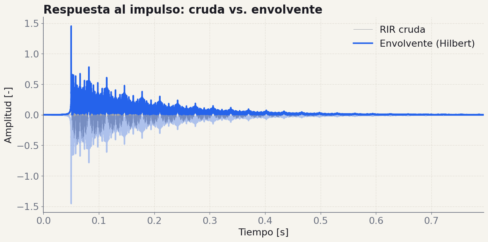
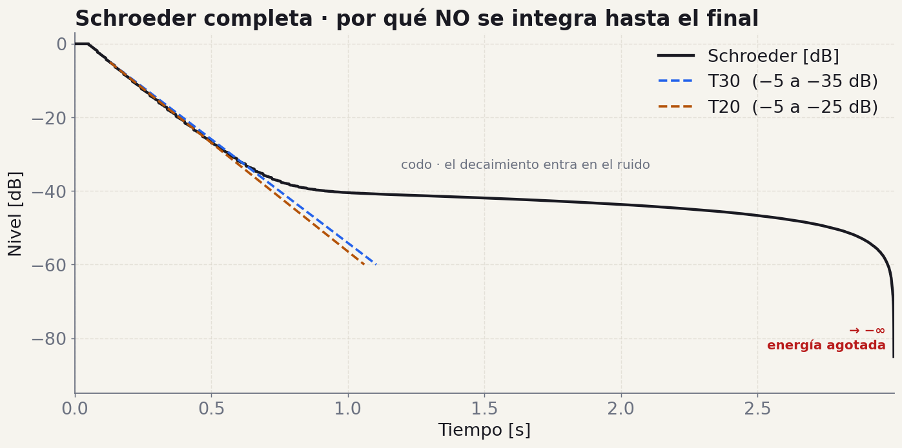
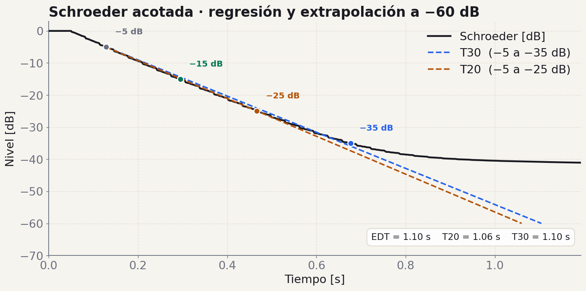
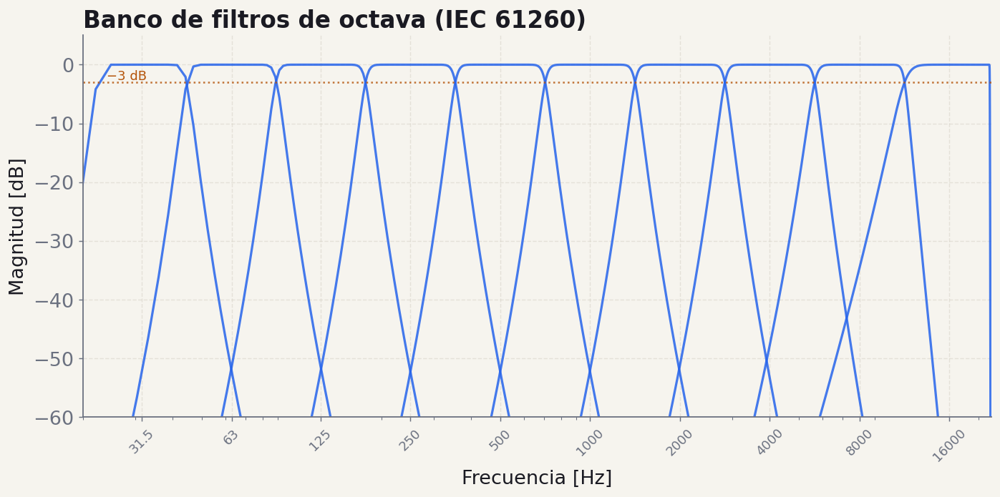
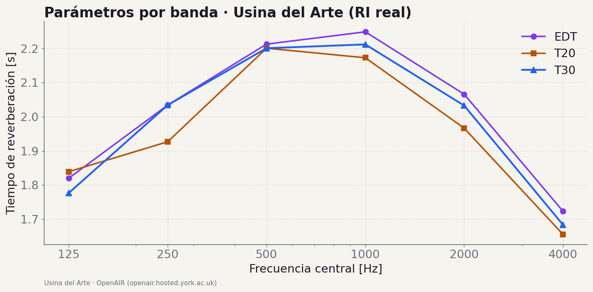
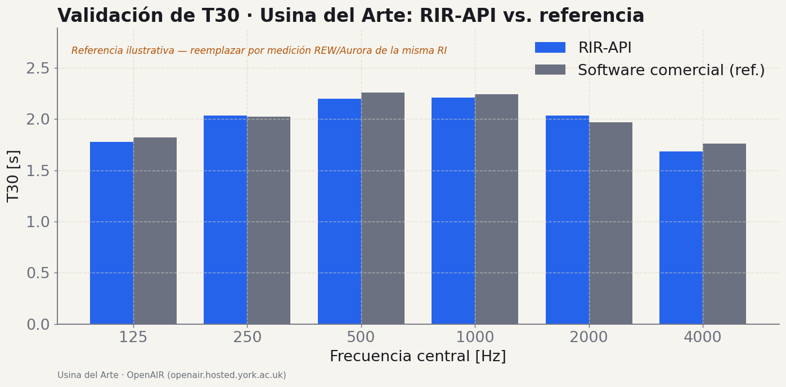

# Milestone 3: Producto Final

!!! info "Fechas y evaluación"
    - **Presentación de la consigna:** miercoles 28 de octubre 2026
    - **Fecha de entrega:** miercoles 18 de noviembre 2026, junto con la presentacion oral (Demo Day)
    - **Tag de version:** `v1.0.0`
    - **Evaluación:** **con nota** — Nota del TP = 60% M3 + 40% presentacion oral (ver [rubrica](../rubrica.md))

## Objetivo

Completar el sistema RIR-API implementando las funciones de analisis acustico (suavizado de senal, integral de Schroeder, regresion lineal, calculo de parametros acusticos segun ISO 3382) y exponiendo **toda la funcionalidad de M1, M2 y M3 como una API REST** con FastAPI. Al finalizar este milestone, la API debe ser capaz de recibir una respuesta al impulso via HTTP, procesarla y devolver todos los parametros acusticos relevantes, con resultados validados contra software comercial.

> **Referencia**: Explorar la [documentacion interactiva de la API de la catedra](https://rir-api.onrender.com/docs) para entender la estructura de endpoints, schemas y respuestas esperadas.

---

## Qué cambia

### De funciones a producto

Hasta M2 tenían **funciones sueltas** en `services/`. En M3 esas funciones se convierten en un *producto*: un servicio web que cualquiera puede usar por HTTP, con resultados validados contra software comercial.

M3 son cuatro cosas encadenadas:

- **Análisis acústico** — las funciones que faltan para calcular T30/T20/EDT por banda
- **API REST** — exponer todo con FastAPI (routers, schemas, docs)
- **Validación** — comparar contra REW/Aurora sobre RIs reales
- **Comunicación** — validación en el README + demo en vivo y oral

!!! note "El objetivo, en una frase"
    Una API que **recibe una respuesta al impulso vía HTTP, la procesa y devuelve todos los parámetros acústicos relevantes**, con resultados que coinciden con los de un software comercial de referencia.

    Su propia versión de `rir-api.onrender.com` — la misma API de referencia de la cátedra que vienen comparando desde M0.

### Tres capas. Un flujo

FastAPI organiza el código en tres capas que ya vienen en el template:

!!! note "routers/ → services/ → schemas/"
    **routers** reciben el request HTTP y validan · **services** es el DSP puro que ya escribieron (M1+M2) · **schemas** son los modelos Pydantic de entrada/salida.

La clave de M3: **no reescriben el DSP**. Envuelven lo que ya tienen. Un router llama a un service y serializa el resultado con un schema.

!!! note "Endpoints mínimos requeridos"
    | `GET /health` | estado |
    |---|---|
    | `POST /api/v1/signals/*` | pink-noise · sine-sweep · synthetic-ir |
    | `POST /api/v1/filters/band` | filtrado por bandas |
    | `POST /api/v1/acoustics/parameters` | + /parameters/by-bands |
    | `POST /api/v1/analysis/impulse-response` | análisis completo de la RI |
    | `POST /api/v1/utils/*` | schroeder · smoothing · log-scale |

    Con validación Pydantic, errores HTTP (400/422/500), Swagger en `/docs` y ReDoc en `/redoc` generados solos.

## Conceptos y figuras

Lo que hay que entender antes de implementar, con los gráficos de la implementación de referencia de la cátedra.

### Función 01 · de la RI al decaimiento

<figure class="figura-tp" markdown>
[](../img/m3/rir_vs_envolvente.png)
<figcaption markdown="span">RI **sintética** (T60 conocido) · `suavizar_signal` con envolvente de Hilbert · la envolvente revela el decaimiento que el waveform crudo esconde</figcaption>
</figure>

El primer paso del análisis es **suavizar** la RI para ver su decaimiento. La **envolvente de Hilbert** es preferible a la media móvil: no requiere elegir un tamaño de ventana y preserva mejor la estructura temporal.

$$
\text{env}(t) = \big|\, h(t) + j\,\mathcal{H}\{h(t)\} \,\big| \qquad \text{(módulo de la señal analítica)}
$$

**Tip de comunicación:** en el README y en la demo, muestren la *envolvente / curva de decaimiento*, nunca el audio crudo. El waveform cru­do "lleno" no comunica nada; la envolvente muestra exactamente cómo cae la energía.

<small>Especificación (m3_producto_final) §1 — `scipy.signal.hilbert` devuelve la señal analítica; su módulo es la envolvente.</small>

### Dos miradas a la misma curva

<figure class="figura-tp" markdown>
[](../img/m3/schroeder_completo.png)
<figcaption markdown="span">Completa · sin truncar — el decaimiento entra en el ruido (codo) y, al agotarse la energía, la curva cae a −∞. Por eso NO se integra hasta el final.</figcaption>
</figure>

<figure class="figura-tp" markdown>
[](../img/m3/schroeder_regresiones.png)
<figcaption markdown="span">Acotada · sobre el tramo lineal se ajusta la recta (mínimos cuadrados) y se extrapola a −60 dB → T20, T30, EDT.</figcaption>
</figure>

**Integral de Schroeder** · integración inversa de la energía (`np.cumsum(energia[::-1])[::-1]`), en dB normalizada a 0 dB. Sobre el tramo recto, **regresión lineal** → pendiente $m$ → $T_{60} = -60/m$ (con $R^2 > 0.99$).

$$
E[n] = \sum_{k=n}^{N-1} h^2[k], \qquad L[n] = 10\,\log_{10}\!\frac{E[n]}{E[0]}, \qquad T_{60} = \frac{-60}{m}
$$

<small>Nunca se integra hasta el final (izquierda: la curva se desploma a −∞). Se trunca en el cruce con el ruido usando `metodo_lundeby` y se mide sobre el tramo lineal (derecha). RI sintética con T60 conocido · Especificación (m3_producto_final) §2–3 · Schroeder 1965.</small>

### Tres tramos, tres parámetros

Cada parámetro es una regresión sobre un tramo distinto de la curva de Schroeder. Todos se extrapolan a −60 dB.

| Parámetro | Tramo de la curva | Qué mide |
|---|---|---|
| **EDT**  
Early Decay Time | 0 a −10 dB | Percepción *subjetiva* de la reverberación. Sensible a las primeras reflexiones. |
| **T20** | −5 a −25 dB | Tiempo de reverberación con menos rango dinámico requerido. Útil con SNR limitado. |
| **T30** | −5 a −35 dB | **El estándar.** Preferido cuando SNR > 45 dB. Es el que se reporta como T60. |

> **En ningún caso** se mide directamente un decaimiento de 60 dB — no hay rango dinámico para eso en una sala real. Siempre se mide un tramo corto y se **extrapola** con la pendiente. Todo se calcula **por banda de octava**.

### El eje frecuencial · filtrado por bandas

<figure class="figura-tp" markdown>
[](../img/m3/filtros_octava.png)
<figcaption markdown="span">Banco de filtros Butterworth de octava · IEC 61260 · cada banda cruza a −3 dB en sus flancos</figcaption>
</figure>

Los parámetros acústicos se calculan **banda por banda**: primero se filtra la RI en cada octava (IEC 61260), y sobre cada banda filtrada se corre el pipeline Schroeder → regresión. Esto ya lo tienen de M2.

**Detalle crítico que se arrastra a M3:** usen `sosfiltfilt` (fase cero, forward + backward), nunca `lfilter`. El retardo de grupo de un filtro causal desplaza el inicio del decaimiento y les infla el T60 en graves un 5–15%.

<small>Clase 9 · m3 reutiliza `filtro_octava` de M2 · frecuencias centrales IEC 61260 (125 Hz a 4 kHz para la tabla de validación).</small>

### El output final

<figure class="figura-tp" markdown>
[](../img/m3/parametros_por_banda.png)
<figcaption markdown="span">EDT · T20 · T30 por banda (125 Hz – 4 kHz) · **RI real** de la Usina del Arte (sala sinfónica, Buenos Aires) · fuente: OpenAIR (York)</figcaption>
</figure>

Este es el **producto final del análisis**: los tres parámetros contra la frecuencia central de cada banda. Es lo que devuelve `calcular_parametros_acusticos` y lo que su API expone en `/api/v1/acoustics/parameters/by-bands`.

Acá se ve una **sala real**: la Usina del Arte, con T30 ≈ 2 s y la forma de *campana* típica (máximo en medios, caída en graves y agudos por absorción). A diferencia de la RI sintética de esta página 6–7 (donde `EDT ≈ T20 ≈ T30`), acá los parámetros **se separan**: cuando `EDT` supera a `T30` hay reflexiones tempranas fuertes; las diferencias entre bandas son información acústica real de la sala.

<small>ISO 3382 · el mismo gráfico que van a ver en el frontend de cátedra cuando suban su WAV. Sintética = enseñar el método (T60 conocido) · real = validar el producto.</small>

### Validación · lo que separa un TP de un producto

<figure class="figura-tp" markdown>
[](../img/m3/validacion_comercial.png)
<figcaption markdown="span">T30 por banda · **Usina del Arte** (RI real) · RIR-API vs. software de referencia — el formato que va en el README (la serie de referencia acá es ilustrativa)</figcaption>
</figure>

No alcanza con que los tests pasen. Hay que demostrar que los números **coinciden con un software profesional** sobre RIs reales.

- Al menos **2 RIs**: una sintética y una real (OpenAIR)
- Comparar contra **REW, ARTA, Aurora o Dirac**
- Bandas 125, 250, 500, 1000, 2000, 4000 Hz

!!! note "Criterio de aceptación"
    Los tiempos de reverberación (**EDT, T20, T30**) no deben diferir en más de **±0.5 s** respecto de la referencia.

    Si su pendiente da la mitad que la de REW, hay un bug — probablemente en el filtrado o en los límites de Schroeder.

> **Grupos con validación sólida:** lúzcanla en la presentación. Una tabla RIR-API vs REW banda por banda con diferencias < 0.5 s es lo más convincente que pueden mostrar.

## Funciones a implementar

### 1. `suavizar_signal(signal, ventana)`

**Firma sugerida:**
```python
def suavizar_signal(
    signal: np.ndarray, ventana: int | str = 'hilbert'
) -> np.ndarray:
    """
    Suaviza una senal para reducir fluctuaciones del ruido.

    Parameters
    ----------
    signal : np.ndarray
        Senal de entrada (tipicamente una RI filtrada por banda).
    ventana : int | str
        Si es int: tamano de la ventana para media movil (en muestras).
        Si es 'hilbert': usa la envolvente de Hilbert.

    Returns
    -------
    np.ndarray
        Senal suavizada (envolvente de energia).
    """
```

**Fundamento matematico:**

**Opcion A - Media movil:**

La media movil de una senal $x[n]$ con ventana de tamano $M$ es:

$$y[n] = \frac{1}{M} \sum_{k=0}^{M-1} x^2[n-k]$$

Notar que se trabaja con la energia ($x^2$) y no con la amplitud directamente, ya que los parametros acusticos se definen en terminos de energia.

**Opcion B - Envolvente de Hilbert (recomendada):**

La envolvente de Hilbert proporciona la envolvente instantanea de la senal mediante la senal analitica:

$$z(t) = x(t) + j \hat{x}(t)$$

donde $\hat{x}(t)$ es la transformada de Hilbert de $x(t)$, definida como:

$$\hat{x}(t) = \frac{1}{\pi} \text{v.p.} \int_{-\infty}^{\infty} \frac{x(\tau)}{t - \tau} d\tau$$

La envolvente instantanea es:

$$A(t) = |z(t)| = \sqrt{x^2(t) + \hat{x}^2(t)}$$

En Python, se obtiene con `scipy.signal.hilbert`:
```python
analitica = scipy.signal.hilbert(signal)
envolvente = np.abs(analitica)
```

La envolvente de Hilbert es preferible porque no requiere elegir un tamano de ventana y preserva mejor la estructura temporal del decaimiento.

---

### 2. `integral_schroeder(ri)`

**Firma sugerida:**
```python
def integral_schroeder(ri: np.ndarray) -> np.ndarray:
    """
    Calcula la integral de Schroeder (integracion inversa).

    Parameters
    ----------
    ri : np.ndarray
        Respuesta al impulso (o RI filtrada por banda).

    Returns
    -------
    np.ndarray
        Curva de decaimiento de Schroeder en dB, normalizada a 0 dB.
    """
```

**Fundamento matematico:**

La integral de Schroeder representa la curva de decaimiento de la energia acustica en un recinto. Se obtiene mediante la integracion inversa (de atras hacia adelante) de la energia de la respuesta al impulso:

$$E(t) = \int_{t}^{\infty} h^2(\tau) \, d\tau$$

En la practica, con senales discretas de duracion finita $T$:

$$E[n] = \sum_{k=n}^{N-1} h^2[k]$$

donde $N$ es el numero total de muestras.

La curva de decaimiento en dB, normalizada respecto a la energia total:

$$L(t) = 10 \log_{10}\left(\frac{E(t)}{E(0)}\right) = 10 \log_{10}\left(\frac{\sum_{k=n}^{N-1} h^2[k]}{\sum_{k=0}^{N-1} h^2[k]}\right)$$

**Implementacion eficiente:**

La integral se calcula eficientemente usando `np.cumsum` sobre la senal invertida:

```python
energia = ri ** 2
integral_inversa = np.cumsum(energia[::-1])[::-1]
integral_db = 10 * np.log10(integral_inversa / integral_inversa[0] + eps)
```

donde `eps` es un valor pequeno para evitar logaritmo de cero.

**Nota importante:** La calidad de la integral de Schroeder depende fuertemente de que la RI tenga suficiente relacion senal a ruido (SNR). Si el ruido de fondo es significativo, la curva de decaimiento se aplana al final en lugar de seguir decayendo. Esto afecta directamente el calculo de $T_{60}$.

**Referencia:** Schroeder, M. R. (1965). "New method of measuring reverberation time." *Journal of the Acoustical Society of America*, 37(3), 409-412.

---

### 3. `regresion_lineal(x, y)`

**Firma sugerida:**
```python
def regresion_lineal(
    x: np.ndarray, y: np.ndarray
) -> tuple[float, float, float]:
    """
    Calcula la regresion lineal por minimos cuadrados.

    Parameters
    ----------
    x : np.ndarray
        Variable independiente (tipicamente tiempo en segundos).
    y : np.ndarray
        Variable dependiente (tipicamente curva de Schroeder en dB).

    Returns
    -------
    tuple[float, float, float]
        (pendiente, ordenada_al_origen, r_cuadrado)
        pendiente en dB/s, ordenada en dB, coeficiente de determinacion.
    """
```

**Fundamento matematico:**

La regresion lineal por minimos cuadrados ajusta una recta $y = mx + b$ minimizando la suma de errores cuadraticos:

$$m = \frac{N \sum x_i y_i - \sum x_i \sum y_i}{N \sum x_i^2 - (\sum x_i)^2}$$

$$b = \frac{\sum y_i - m \sum x_i}{N}$$

El coeficiente de determinacion $R^2$ indica la calidad del ajuste:

$$R^2 = 1 - \frac{\sum (y_i - \hat{y}_i)^2}{\sum (y_i - \bar{y})^2}$$

donde $\hat{y}_i = m x_i + b$ es el valor predicho e $\bar{y}$ es el promedio de $y$.

**Uso en el contexto acustico:**

La pendiente $m$ de la recta ajustada a la curva de Schroeder se usa para calcular el tiempo de reverberacion:

$$T_{60} = \frac{-60}{m}$$

Un $R^2 > 0.99$ indica un decaimiento bien definido. Valores menores sugieren problemas con la medicion o la senal.

**Implementacion:** Se puede usar `np.polyfit(x, y, 1)` o implementarlo manualmente con las formulas anteriores. Se recomienda la implementacion manual para demostrar comprension del metodo.

---

### 4. `calcular_parametros_acusticos(ri, fs)`

**Firma sugerida:**
```python
def calcular_parametros_acusticos(
    ri: np.ndarray, fs: int
) -> dict[str, dict[float, float]]:
    """
    Calcula los parametros acusticos ISO 3382 por banda de octava.

    Parameters
    ----------
    ri : np.ndarray
        Respuesta al impulso.
    fs : int
        Frecuencia de muestreo en Hz.

    Returns
    -------
    dict[str, dict[float, float]]
        Diccionario con parametros acusticos por banda.
        Estructura: {parametro: {frecuencia_central: valor}}
        Ejemplo: {'T30': {125: 1.5, 250: 1.3, ...}, 'EDT': {...}, ...}
    """
```

**Parametros a calcular:**

#### a) EDT (Early Decay Time)

El EDT se calcula a partir de la pendiente de la curva de Schroeder entre **0 dB y -10 dB**, extrapolada a -60 dB:

$$\text{EDT} = \frac{-60}{m_{0,-10}}$$

donde $m_{0,-10}$ es la pendiente de la regresion lineal entre los puntos de 0 dB y -10 dB.

El EDT es un indicador de la percepcion subjetiva de la reverberacion, mas relevante para la experiencia auditiva que el $T_{60}$.

#### b) $T_{10}$, $T_{20}$, $T_{30}$ (Tiempos de reverberacion)

Se calculan a partir de diferentes rangos de la curva de Schroeder:

- **$T_{10}$**: pendiente entre **-5 dB y -15 dB**, extrapolada a -60 dB:
  $$T_{10} = \frac{-60}{m_{-5,-15}}$$

- **$T_{20}$**: pendiente entre **-5 dB y -25 dB**, extrapolada a -60 dB:
  $$T_{20} = \frac{-60}{m_{-5,-25}}$$

- **$T_{30}$**: pendiente entre **-5 dB y -35 dB**, extrapolada a -60 dB:
  $$T_{30} = \frac{-60}{m_{-5,-35}}$$

La norma ISO 3382 establece que **$T_{30}$ es el parametro preferido** cuando la relacion senal a ruido lo permite (SNR > 45 dB).

#### c) $T_{60}$ (Tiempo de reverberacion)

El $T_{60}$ se reporta tipicamente como $T_{30}$ (extrapolado) o $T_{20}$ si la SNR es insuficiente para $T_{30}$:

$$T_{60} \approx T_{30} \quad \text{(preferido)}$$
$$T_{60} \approx T_{20} \quad \text{(alternativa)}$$

En ningun caso se mide directamente el decaimiento de 60 dB, ya que requeriria una SNR impracticable.

#### d) $D_{50}$ (Definicion / Deutlichkeit)

La Definicion $D_{50}$ es la relacion entre la energia en los primeros 50 ms y la energia total:

$$D_{50} = \frac{\int_0^{50\text{ms}} h^2(t) \, dt}{\int_0^{\infty} h^2(t) \, dt} \times 100\%$$

En forma discreta:

$$D_{50} = \frac{\sum_{n=0}^{N_{50}} h^2[n]}{\sum_{n=0}^{N-1} h^2[n]} \times 100\%$$

donde $N_{50} = \lfloor 0.050 \cdot f_s \rfloor$ es el numero de muestras correspondiente a 50 ms.

$D_{50}$ es un parametro relacionado con la **inteligibilidad de la palabra**. Valores altos indican buena claridad del habla.

#### e) $C_{80}$ (Claridad / Clarity)

La Claridad $C_{80}$ es la relacion en dB entre la energia temprana (primeros 80 ms) y la energia tardia (despues de 80 ms):

$$C_{80} = 10 \log_{10}\left(\frac{\int_0^{80\text{ms}} h^2(t) \, dt}{\int_{80\text{ms}}^{\infty} h^2(t) \, dt}\right) \text{ [dB]}$$

En forma discreta:

$$C_{80} = 10 \log_{10}\left(\frac{\sum_{n=0}^{N_{80}} h^2[n]}{\sum_{n=N_{80}+1}^{N-1} h^2[n]}\right)$$

donde $N_{80} = \lfloor 0.080 \cdot f_s \rfloor$.

$C_{80}$ es un parametro fundamental para la **calidad musical**. Valores tipicos:
- Musica sinfonica: -2 a +2 dB
- Musica de camara: +2 a +5 dB
- Palabra hablada: > +5 dB

---

### 5. API REST - Integracion completa con FastAPI

Toda la funcionalidad desarrollada en M1, M2 y M3 debe exponerse como endpoints de una API REST. La API debe seguir la arquitectura de capas: **routers** (endpoints) → **services** (logica de negocio) → **schemas** (validacion con Pydantic).

**Estructura de la API:**

```
app/
├── main.py                    # Punto de entrada FastAPI + CORS
├── settings.py                # Configuracion con pydantic-settings
├── routers/
│   ├── health.py              # GET /health
│   ├── signals.py             # POST /api/v1/signals/*
│   ├── filters.py             # POST /api/v1/filters/*
│   ├── acoustics.py           # POST /api/v1/acoustics/*
│   ├── analysis.py            # POST /api/v1/analysis/*
│   └── utils.py               # POST /api/v1/utils/*
├── schemas/
│   ├── signals.py             # Modelos de request/response para senales
│   ├── filters.py             # Modelos para filtrado
│   └── responses.py           # Modelos de respuesta para analisis
└── services/
    ├── pink_noise.py          # Generacion de ruido rosa
    ├── sine_sweep.py          # Generacion de sine sweep
    ├── filter.py              # Filtros de banda
    ├── signal_utils.py        # Utilidades de procesamiento
    └── acoustic_parameters.py # Calculo de parametros acusticos
```

**Endpoints minimos requeridos:**

| Grupo | Endpoint | Metodo | Descripcion |
|-------|----------|--------|-------------|
| Base | `/health` | GET | Health check |
| Signals | `/api/v1/signals/pink-noise` | POST | Genera ruido rosa |
| Signals | `/api/v1/signals/sine-sweep` | POST | Genera sine sweep logaritmico |
| Signals | `/api/v1/signals/synthetic-ir` | POST | Genera RI sintetica |
| Filters | `/api/v1/filters/band` | POST | Filtra audio por bandas de octava |
| Filters | `/api/v1/filters/frequencies` | GET | Lista frecuencias centrales |
| Acoustics | `/api/v1/acoustics/parameters` | POST | Calcula parametros acusticos |
| Acoustics | `/api/v1/acoustics/parameters/by-bands` | POST | Parametros por bandas |
| Analysis | `/api/v1/analysis/impulse-response` | POST | Analisis completo de RI |
| Utils | `/api/v1/utils/schroeder` | POST | Integral de Schroeder |
| Utils | `/api/v1/utils/smoothing` | POST | Suavizado de senal |
| Utils | `/api/v1/utils/log-scale` | POST | Conversion a escala dB |

**Requisitos de la API:**
- Documentacion automatica via Swagger UI (`/docs`) y ReDoc (`/redoc`).
- Validacion de entrada con schemas Pydantic (tipos, rangos, formatos).
- Manejo de errores con codigos HTTP apropiados (400, 422, 500).
- Configuracion via variables de entorno (CORS, limites de archivo, etc.).
- Los endpoints de archivos de audio deben aceptar uploads via `multipart/form-data`.
- Los endpoints de generacion deben devolver archivos WAV descargables.
- Debe poder ejecutarse con `uvicorn app.main:app --reload`.

---

## Funcion extra (opcional, suma puntos)

### `metodo_lundeby(ri, fs)`

```python
def metodo_lundeby(
    ri: np.ndarray, fs: int
) -> tuple[int, float]:
    """
    Determina el punto de truncamiento de la RI usando el metodo de Lundeby.

    Parameters
    ----------
    ri : np.ndarray
        Respuesta al impulso.
    fs : int
        Frecuencia de muestreo en Hz.

    Returns
    -------
    tuple[int, float]
        (indice_truncamiento, nivel_ruido_dB)
        Indice de la muestra donde la RI se cruza con el ruido de fondo
        y el nivel estimado de ruido en dB.
    """
```

**Fundamento matematico:**

El metodo de Lundeby busca iterativamente el punto donde la curva de decaimiento de la RI se encuentra con el nivel de ruido de fondo. Esto permite definir limites de integracion mas precisos para la integral de Schroeder.

**Algoritmo:**

1. Calcular la curva de decaimiento promediada en intervalos (por ejemplo, intervalos de 10-30 ms).
2. Estimar el nivel de ruido de fondo como el promedio de los ultimos 10% de la senal.
3. Encontrar el punto de cruce preliminar entre la curva de decaimiento y el nivel de ruido + 10 dB.
4. Realizar una regresion lineal desde el inicio hasta el punto de cruce.
5. Iterar: recalcular el nivel de ruido, el punto de cruce y la regresion hasta convergencia.
6. El punto de truncamiento final es donde la recta de regresion cruza el nivel de ruido.

**Uso:** El punto de truncamiento se usa para corregir la integral de Schroeder. Las muestras despues del punto de truncamiento se reemplazan por la extrapolacion de la recta de regresion antes de integrar.

**Referencia:** Lundeby, A., et al. (1995). "Uncertainties of measurements in room acoustics." *Acustica*, 81(4), 344-355.

---

## Tests requeridos

### Test 1: Suavizado

```python
def test_suavizar_hilbert_envolvente():
    """La envolvente debe ser no negativa y suave."""

def test_suavizar_media_movil_longitud():
    """La salida debe tener la misma longitud que la entrada."""
```

### Test 2: Integral de Schroeder

```python
def test_schroeder_maximo_cero_db():
    """El primer valor de la integral de Schroeder debe ser 0 dB."""

def test_schroeder_decreciente():
    """La integral de Schroeder debe ser monotonamente decreciente."""

def test_schroeder_ri_sintetizada():
    """
    Para una RI sintetizada con T60 conocido,
    la curva de Schroeder debe ser aproximadamente lineal
    con pendiente -60/T60 dB/s.
    """
```

### Test 3: Regresion lineal

```python
def test_regresion_lineal_exacta():
    """Para datos perfectamente lineales, R^2 debe ser 1.0."""

def test_regresion_lineal_pendiente():
    """Verificar pendiente con datos conocidos."""
```

### Test 4: Parametros acusticos con RI sintetizada

```python
def test_parametros_ri_sintetizada():
    """
    Sintetizar una RI con T60 = 2.0 s, calcular parametros
    y verificar que T30 esta dentro del +-10% del valor conocido.
    """

def test_d50_rango():
    """D50 debe estar entre 0% y 100%."""

def test_c80_consistencia():
    """Para una RI con mucha energia temprana, C80 debe ser positivo."""
```

### Test 5: API endpoints

```python
def test_health_endpoint():
    """Verificar que /health responde correctamente."""

def test_analysis_endpoint():
    """Enviar un archivo WAV a /api/v1/analysis/impulse-response y verificar respuesta."""

def test_signals_pink_noise_endpoint():
    """Verificar que /api/v1/signals/pink-noise genera y devuelve un WAV valido."""

def test_invalid_file_returns_422():
    """Verificar que un archivo invalido retorna 422 Unprocessable Entity."""
```

**Nota:** Usar `httpx.AsyncClient` o `fastapi.testclient.TestClient` para tests de API.

---

## Validacion final

### Comparacion con software comercial

Los resultados de RIR-API deben compararse con al menos **uno** de los siguientes softwares de referencia:

- **REW (Room EQ Wizard)** - gratuito
- **ARTA** - version de evaluacion disponible
- **Aurora Plugins** (para Audacity)
- **Dirac** (Bruel & Kjaer)

**Criterio de aceptacion:**

> Los resultados obtenidos no deben diferir en mas de **+-0.5 s** de los arrojados por el software comercial para los tiempos de reverberacion ($T_{20}$, $T_{30}$, EDT), y no mas de **+-1 dB** para $C_{80}$.

**Tabla de validacion requerida** (incluir en el README y mostrar en la presentacion oral):

| Parametro | Banda (Hz) | RIR-API | Software ref. | Diferencia | Dentro de tolerancia |
|-----------|-----------|-----------|---------------|------------|---------------------|
| EDT       | 125       |           |               |            |                     |
| EDT       | 250       |           |               |            |                     |
| ...       | ...       |           |               |            |                     |
| T30       | 125       |           |               |            |                     |
| ...       | ...       |           |               |            |                     |
| C80       | 1000      |           |               |            |                     |

Completar la tabla para al menos las bandas de 125, 250, 500, 1000, 2000 y 4000 Hz, con al menos 2 RIs diferentes (una sintetizada y una real).

---

## Validacion y resultados en el README

Este cuatrimestre **no hay informe escrito**. En su lugar, el README del repositorio debe incluir una seccion **Validacion** con:

- La tabla comparativa RIR-API vs. software de referencia (ver arriba).
- Al menos 3 graficas: (1) curva de decaimiento, (2) comparacion de filtros, (3) validacion con software comercial.
- El diagrama de arquitectura actualizado.

Estos mismos resultados se muestran en la presentacion oral.

---

## Presentacion oral final

- **Duracion**: 20 minutos de presentacion + 5 minutos de preguntas.
- **Formato**: virtual (sesion del miercoles 18/11), con apoyo de material visual.
- **Demostracion en vivo obligatoria**: mostrar la API corriendo, enviar requests y mostrar las respuestas.

### Estructura recomendada

1. **Introduccion** (3 min): contexto, equipo, arquitectura de la API.
2. **Desarrollo tecnico** (8 min): demo en vivo de la API (Swagger UI, requests con curl/httpx), decisiones de diseno, integracion de capas.
3. **Resultados y validacion** (6 min): comparacion con software comercial, analisis de precision.
4. **Reflexiones** (3 min): dificultades, aprendizajes, mejoras posibles.

### Pregunta de reflexion obligatoria

Cada grupo debe prepararse para responder: *"Que fue lo mas valioso que aprendieron desarrollando este proyecto y como lo aplicarian en su carrera profesional?"*

---

## Calidad de codigo (requisitos acumulativos)

Todos los requisitos de M1 y M2 aplican, mas:

- **Cobertura de tests**: minimo 80% en funciones de analisis y tests de API.
- **CI funcionando**: GitHub Actions ejecutando tests y linting en cada push.
- **Documentacion de API**: Swagger UI y ReDoc generados automaticamente. Docstrings completos en funciones publicas.
- **README actualizado** con instrucciones de ejecucion de la API y ejemplos de uso con `curl`.
- **Tag `v1.0.0`** en la rama `main` al entregar.
- **Release en GitHub** con changelog resumido.

---

## Guía de entrega

### La demo en vivo

En el Demo Day, mostrar la API *corriendo* no es opcional. Es parte central de la nota de presentación.

Guion sugerido de la demo (≈ 8 min):

1. Levantar la API: `uvicorn app.main:app --reload`
1. Abrir `/docs` (Swagger) y recorrer los endpoints
1. Subir un WAV real a `/analysis/impulse-response`
1. Mostrar la respuesta JSON con los parámetros por banda
1. Un `curl` desde la terminal para el mismo endpoint

Tengan un WAV de prueba listo y la API ya levantada antes de arrancar. No debuggeen en vivo.

!!! note "La referencia de cátedra"
    Su API tiene que hacer lo mismo que esta. Compárense contra ella hasta el final:

    rir-api.onrender.com/docs

    Suban la misma RI a su API y a la de cátedra. Si los números coinciden, están listos.

### Tres gráficas obligatorias

Son el corazón de la validación en el README y de la presentación oral — las mismas que vieron en esta página.

<figure class="figura-tp" markdown>
[](../img/m3/schroeder_regresiones.png)
<figcaption markdown="span">1 · Curva de decaimiento (Schroeder + regresiones)</figcaption>
</figure>

<figure class="figura-tp" markdown>
[](../img/m3/filtros_octava.png)
<figcaption markdown="span">2 · Comparación de filtros por banda</figcaption>
</figure>

<figure class="figura-tp" markdown>
[](../img/m3/validacion_comercial.png)
<figcaption markdown="span">3 · Validación vs. software comercial</figcaption>
</figure>

!!! note "También conviene incluir"
    Diagrama de arquitectura del software · RI vs. envolvente · parámetros por banda · tabla comparativa RIR-API vs. referencia.

!!! note "Cómo presentarlas"
    Título y ejes rotulados **con unidades** · legibles al proyectar · para la RI mostrar **envolvente/decaimiento**, nunca audio crudo · una idea por figura.

### Lo que tiene que estar el 18 de noviembre

- [ ] Las 4 funciones de análisis + la API con los endpoints mínimos
- [ ] `pytest` en verde · cobertura > 80% en análisis y API
- [ ] CI de GitHub Actions **verde** en cada push
- [ ] Swagger (`/docs`) y ReDoc (`/redoc`) funcionando
- [ ] README con instrucciones de ejecución y ejemplos `curl`

- [ ] README con la sección **Validación**: 3 gráficas y tabla comparativa
- [ ] `AI_LOG.md` **en la raíz**, con entradas de M0 a M3
- [ ] Tag `v1.0.0` en `main`, apuntando al commit final real
- [ ] Release en GitHub con changelog resumido
- [ ] Demo lista: WAV de prueba + API levantada

!!! note ""
    **CI que engaña:** si `ruff` corta antes de `pytest`, los tests nunca corren en CI aunque pasen local. Y si el workflow lintea la carpeta equivocada (`src/` en vez de `app/`), no valida nada. Revisen el YAML.

### Errores que no se repiten

Los tropiezos más comunes de las entregas anteriores. Ninguno es de DSP — todos son de proceso.

!!! note "Git y entrega"
    - Los tres tags apuntando al mismo commit de README, no al código
    - Sin tag, o `pyproject.toml` desactualizado
    - Merge a `main` dejado para la hora de cierre
    - Marcador de conflicto (`>>>>>>>`) commiteado → rompe todos los tests

!!! note "Código y entorno"
    - `ModuleNotFoundError: app` en CI → falta `pythonpath = ["."]` en `pyproject.toml`
    - Cientos de warnings de `ruff` sin resolver → `ruff check --fix` + `ruff format`
    - `NotImplementedError` olvidado arriba de la función real
    - Archivos basura versionados (rutas locales, `output.txt`, scripts de prueba)

> **La lección transversal:** lo que rompe las entregas casi nunca es el procesamiento de señales — es Git, CI y prolijidad. Dediquen tiempo real a eso esta semana.

### 20 minutos + 5 de preguntas

Estructura recomendada:

| **Introducción** | 3 min | contexto, equipo, arquitectura |
|---|---|---|
| **Desarrollo técnico** | 8 min | demo en vivo de la API |
| **Resultados** | 6 min | validación, precisión |
| **Reflexiones** | 3 min | dificultades, aprendizajes |

Material visual legible al proyectar. Gráficos grandes, con ejes y unidades.

!!! note "Pregunta obligatoria"
    Cada grupo tiene que estar preparado para responder:

    > **¿Qué fue lo más valioso que aprendieron desarrollando este proyecto y cómo lo aplicarían en su carrera profesional?**

    No es un trámite. Piénsenla en grupo antes del Demo Day.

## Recursos

- [API de referencia de la catedra (Swagger UI)](https://rir-api.onrender.com/docs)
- [FastAPI: documentacion oficial](https://fastapi.tiangolo.com/)
- [Pydantic: validacion de datos](https://docs.pydantic.dev/)
- [FastAPI TestClient](https://fastapi.tiangolo.com/tutorial/testing/)
- [ISO 3382-1:2009 - Measurement of room acoustic parameters](https://www.iso.org/standard/40979.html)
- [Schroeder, M. R. (1965) - New method of measuring reverberation time](https://asa.scitation.org/doi/10.1121/1.1909343)
- [Lundeby, A. et al. (1995) - Uncertainties of measurements in room acoustics](https://doi.org/10.1155/1995/37816)
- [scipy.signal.hilbert](https://docs.scipy.org/doc/scipy/reference/generated/scipy.signal.hilbert.html)
- [REW - Room EQ Wizard](https://www.roomeqwizard.com/)
